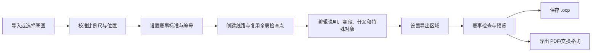

# O-Composer 项目级用户指南

- 适用版本：**0.0.4**
- 文档语言：**简体中文**
- 适用对象：线路设计员、赛事总监、制图员、裁判、打印与出图人员、第一次使用 O-Composer 的用户

O-Composer 是一个完全在浏览器中运行的定向越野线路设计工具。它可以创建和编辑完整的 O-Composer `.ocp` 项目，打开和导出兼容 `.ppen` 文件，导入 OMAP/XMAP、OCAD、图片或 PDF 底图，设计普通赛、积分赛、团队赛、军事定向（军体定向）和带分叉的接力赛，并输出 PDF、PNG、IOF XML、GPX、KML、RouteGadget XML 与 SVG 叠加层。

本指南以“从空白赛事到可交付文件”为主线，同时保留逐菜单、逐按钮、逐字段的参考说明。它覆盖当前界面可见功能、常见操作手势、四种线路类型、接力分叉、地图翻页、检查点说明、剪线与剪圈、测量、军事坐标格网、打印区域、保存兼容性、三份真实样例地图和故障排查。

> [!TIP]
> 普通用户可直接访问 **[https://maxencesun.github.io/O-Composer/](https://maxencesun.github.io/O-Composer/)** 使用，无需下载源码、安装软件或运行本地服务器。建议使用现代桌面浏览器，并允许浏览器下载生成的 `.ocp`、PDF 和其他导出文件。

> [!IMPORTANT]
> 日常编辑请优先保存为 `.ocp`。只有需要把文件交给 Purple Pen 或其他只接受原生 `.ppen` 的流程时，才使用“导出原生 `.ppen`”。两种文件的兼容边界见[第 21 节](#21-保存导入与导出的兼容性矩阵)。

## 如何使用本指南

- 第一次使用：先读[第 0 节](#0-十分钟快速入门)，再按[第 19 节](#19-三份样例地图的完整实战)完成一次练习。
- 正式办赛：按“底图 → 赛事设置 → 线路 → 说明表 → 检查 → 导出”的顺序工作，并在导出前执行[第 24 节](#24-交付前检查清单)。
- 找不到某个命令：查[第 2 节](#2-顶部菜单)和[第 3 节](#3-快捷工具栏)。
- 不知道鼠标、触控或快捷键怎样操作：查[第 20 节](#20-鼠标触控与快捷键完整参考)。
- 不知道某种赛制该怎样设置：查[第 12 节](#12-积分赛)、[第 13 节](#13-团队赛)、[第 14 节](#14-军事定向军体定向)和[第 15 节](#15-分叉变化线路与接力)。
- 遇到导入、选择、剪圈、翻页、PDF 或浏览器问题：直接查[第 23 节](#23-故障排查与常见问答)。

<details>
<summary><strong>展开完整目录</strong></summary>

- [0. 十分钟快速入门](#0-十分钟快速入门)
- [1. 启动与基础界面](#1-启动与基础界面)
- [2. 顶部菜单](#2-顶部菜单)
- [3. 快捷工具栏](#3-快捷工具栏)
- [4. 线路标签与地图上方信息栏](#4-线路标签与地图上方信息栏)
- [5. 左侧面板](#5-左侧面板)
- [6. 调整区详细说明](#6-调整区详细说明)
- [7. 设置导出区域](#7-设置导出区域弹窗)
- [8. PDF 导出](#8-pdf-导出弹窗)
- [9–11. 文字、删除与标准](#9-添加文字弹窗)
- [12. 积分赛](#12-积分赛)
- [13. 团队赛](#13-团队赛)
- [14. 军事定向（军体定向）](#14-军事定向军体定向)
- [15. 分叉、变化线路与接力](#15-分叉变化线路与接力)
- [16. 地图翻页、换图与翻图](#16-地图翻页换图与翻图)
- [17. OCAD 浏览器导入](#17-ocad-浏览器导入说明)
- [18. 底图导入、替换、移动与校准](#18-底图导入替换移动与校准)
- [19. 三份样例地图完整实战](#19-三份样例地图的完整实战)
- [20. 鼠标、触控与快捷键](#20-鼠标触控与快捷键完整参考)
- [21. 保存、导入与导出兼容矩阵](#21-保存导入与导出的兼容性矩阵)
- [22. 说明表、常量、报告与属性](#22-说明表常量报告与属性参考)
- [23. 故障排查与常见问答](#23-故障排查与常见问答)
- [24. 交付前检查清单](#24-交付前检查清单)
- [25. 浏览器、离线与实现边界](#25-浏览器离线与实现边界)

</details>

## 核心概念

| 名称 | 含义 | 最容易混淆的地方 |
| --- | --- | --- |
| 赛事 | 一个项目的顶层容器，包含底图、全局检查点、线路、特殊对象、打印区域和设置 | “新建赛事”会清空整个项目，不等于只添加一条线路 |
| 全局检查点 | 赛事内可被多条线路复用的点对象 | 从一条线路移除检查点，不一定删除全局对象 |
| 线路 | 参赛者需要完成的一套线路规则 | 普通、积分、团队、军体四种类型的排序和说明表规则不同 |
| 赛段 | 一条具体线路上相邻两个线路节点之间的连接 | 可设置引导范围、弯折点和手动缺口 |
| 分叉 | 普通线路中的 fork/branch 拓扑 | “所有分支”是总览，不是一条具有唯一顺序的具体线路 |
| 地图页面 | 同一条具体线路因换图、翻图而拆出的页面 | 页面边界点会同时出现在前后两页 |
| 导出区域 | PDF 页面在地图上的纸张范围 | 可分别属于所有检查点、某线路或某线路的某一页 |
| 检查点说明 | IOF/ISCD 风格说明数据及其地图表格对象 | 编辑说明数据与在地图上放置说明表是两件事 |
| 特殊对象 | 禁区、危险区、文字、线、说明表等非检查点对象 | 可只显示于指定线路，也可显示于全部线路 |



## 0. 十分钟快速入门

1. 用浏览器直接打开 **[O-Composer 在线版](https://maxencesun.github.io/O-Composer/)**。只有开发、调试或自建部署时才需要在项目目录运行 `python3 run.py`；不要直接双击 `index.html`。
2. 首次进入时选择语言、渲染质量和界面模式。常规电脑建议“中文 / 均衡 / 自动”。
3. 选择“文件 > 导入 OMAP 地图”，打开 [`samples/beihang_xyl_jiaoxuequ_1000.omap`](samples/beihang_xyl_jiaoxuequ_1000.omap)。在线使用时先通过该链接把样例下载到本机；已下载项目仓库时可直接从 `samples/` 目录选择。该样例是可直接矢量渲染的 1:1000 OMAP 校园图。
4. 选择“线路 > 添加线路”，名称输入“教学线路”，类型选择“普通线路”。
5. 依次点击快捷栏“起点”“检查点”“终点”，在图上放置。起点始终放在线路最前面；若已有发图点，则放在发图点之后。终点始终放在线路末端。
6. 在左侧“说明”面板核对 A 顺序与 B 代码，点击 C–H 单元格填写检查点说明。
7. 选择“添加 > 检查点说明”，再在图上点击放置说明表。
8. 如连线遮挡重要地物，选择“剪断连线”：点击连线可剪线，点击普通检查点圆或终点圆的圆周可剪圈；选中缺口后拖动两个蓝色端点调整。
9. 选择“视图 > 设置导出区域”，选择 A4、横向、5 mm 边距和“移动固定纸张框”，调整后应用。
10. 先“文件 > 保存 .ocp”，再“文件 > 创建 PDF”。在 PDF 弹窗中选择当前线路、包含底图和检查点说明，然后创建。

完成这十步后，已经走通最基本的“导图—设线—说明—剪裁—出图—存档”流程。后续章节解释每个选项的精确含义和高级用法。

## 1. 启动与基础界面

第一次打开页面时，O-Composer 会显示启动进度，并预下载字体、检查点符号 XML 等软件资源。资源下载进度会显示在右上角 O-Composer 版本号旁边，格式为“已下载数据量 / 总数据量”。资源下载完成后进度条会自动消失；只要版本号不变，这些资源会保留在浏览器缓存中。

### 1.1 首次设置

首次打开会出现三个设置：

- **语言**：English 或中文。它影响界面、默认检查点说明语言和保存时写入的说明语言信息。
- **渲染质量**：性能约 1× 画布、均衡约 1.5×、高质量约 2×、极致约 3×。倍数越高越清晰，也越耗显存和时间。大型 OMAP/OCAD 在低配置设备上应先选“性能”或“均衡”；最终检查文字、网纹和复杂符号时再切换。自动默认会参考设备内存、CPU 核心、像素密度、屏幕和触控特征。
- **界面模式**：自动、电脑版、手机版。“自动”根据窗口与设备判断；若平板被错误识别，可在“设置 > 全局选项”手动覆盖。

手机竖屏时会提示旋转设备。横屏能够给地图和编辑面板更多空间，是移动端推荐方向。

进入编辑器后仍可从“设置 > 全局选项”修改三项；切换语言可能触发页面重新加载，应先保存项目。

### 1.2 本地数据、缓存与隐私

O-Composer 是静态前端应用。地图解析、OCAD 转换、Python 翻页公式和文件生成均在当前浏览器内完成；导入的赛事和地图不会因为这些操作自动上传到服务器。

如果浏览器提示是否允许缓存当前赛事和地图：

- **接受 Cookie**：允许浏览器保存当前赛事和底图，下一次打开页面时可以恢复上次状态。
- **暂不**：本次隐藏提示，但不记录长期拒绝；下次重新打开仍可能提示。

同意状态由有效期约 180 天的 Cookie 记录；赛事与底图实际写入 IndexedDB `oComposerWebCache`，状态改变后约 250 ms 覆盖保存为最新会话，原 PDF 另存于 PDF 底图存储。界面目前没有“清除缓存”按钮，需要通过浏览器的站点数据管理清理。隐私模式、配额不足或 IndexedDB 不可用时可能静默失败。

浏览器缓存只能作为便利功能，不能替代项目文件备份。清理站点数据、无痕窗口结束、浏览器配额回收或应用版本切换都可能使缓存失效。每个重要里程碑都应下载 `.ocp` 并复制到赛事资料目录。

地图源数据很大时，缓存可能只保留足以恢复编辑的数据而不保留完整源文件；尤其是超过约 16 MiB 的源地图，不应依赖浏览器缓存长期保存。原始 OMAP、OCAD、图片或 PDF 应单独归档。

顶部右侧包含：

- **反馈通道**：打开反馈链接。
- **O-Composer 版本号**：显示当前三段式版本号，例如 `0.0.4`。
- **资源下载进度**：仅在资源下载中显示。

手机端会使用移动适配布局，支持触摸操作和两指缩放。横屏时左侧为线路/说明/分叉/报告等编辑区，右侧为地图与调整区。

### 1.3 界面区域

从上到下、从左到右分别是：

1. **顶部菜单**：包含所有命令，是查找功能的完整入口。
2. **快捷工具栏**：放置最常用的打开、保存、撤销、加点、剪线、测量、特殊对象和导出区域工具。
3. **线路标签**：在“所有检查点”和各条线路之间切换。
4. **左侧上部面板**：说明、分叉、报告、常量。
5. **左侧下部调整区**：显示当前选中对象的属性；没有选中对象时显示赛事设置。
6. **分叉拓扑列**：普通线路存在分叉时显示可交互的分支树。
7. **地图画布**：放置、移动、选择和预览所有地图对象。
8. **地图上方信息栏**：显示赛事、线路、长度、页面和分支选择。
9. **底部状态栏**：显示操作状态、鼠标地图坐标、未保存标记、缩放和底图强度。

电脑版中，左侧面板、分叉拓扑列和地图之间的竖向分隔条可以拖动。移动端使用“线路”和“面板”下拉框切换内容。

### 1.4 打开方式

- **普通用户首选**：直接打开 [https://maxencesun.github.io/O-Composer/](https://maxencesun.github.io/O-Composer/)，不需要安装或命令行。
- **开发与本地调试**：在 `O-Composer` 目录执行 `python3 run.py`，访问终端显示的地址，默认 `http://localhost:5180/`。
- 只构建静态文件：执行 `python3 build.py`，结果写入 `dist/`。

本地开发时不要直接双击 `index.html`，也不要用 `file://` 访问；模块、Worker、WASM 和字体加载需要 HTTP 服务。在线版已经由 GitHub Pages 正确提供这些资源。

## 2. 顶部菜单

### 2.1 文件

**新建赛事**

清空当前赛事、线路、检查点、底图和选择状态，创建一个空赛事。若当前文件有未保存更改，会先询问是否放弃更改。

**打开示例**

加载内置 [`samples/standalone-sample.ppen`](samples/standalone-sample.ppen)，便于快速体验线路、检查点、说明表和导出功能。

**打开 .ocp/.ppen**

从本地选择并打开 O-Composer `.ocp` 或兼容 `.ppen` 文件。选择器也允许 `.xml`，但它必须是 O-Composer/Purple Pen `course-scribe-event` 结构；这里不是 IOF XML 导入入口。打开后会重置视图缩放和平移，并选择文件中的第一条线路。

**保存 .ocp**

将当前赛事完整保存为 `.ocp` 文件并下载到本地。`.ocp` 是 O-Composer 的完整项目格式，会保留团队赛、接力自动分配、自定义常量等 O-Composer 功能。保存时会同步当前界面语言对应的检查点说明语言。

**另存为**

当前行为与“保存 .ocp”一致，会下载一份 `.ocp` 文件。

**导出原生 .ppen**

导出兼容 `.ppen` 文件。导出时会尽量使用 `.ppen` 兼容字段，并对 O-Composer 扩展功能做降级或省略；例如团队赛会按普通线路导出，自定义常量、队号前缀、队号位数、每棒名称以及高级翻页公式等 O-Composer 专属信息不会写入兼容 `.ppen`。普通线路直接设置的翻页点会以 Purple Pen 的换图/翻图字段保存。

**选择地图图片/PDF**

导入位图或 PDF 作为底图。文件选择器限制为浏览器支持的 `image/*`、`application/pdf` 和 `.pdf`；如果解析失败会显示错误信息。

- 图片底图会按图片原始宽高导入。
- PDF 底图会先选择页码，再以高分辨率渲染为底图，同时缓存原始 PDF 数据用于后续矢量 PDF 合并。
- 新导入图片或 PDF 后会立即进入强制两点比例尺校准。在地图上选择两点，并在校准 palette 中输入地图比例尺以及图上距离或实地距离；palette 打开时仍可拖动两个参考点。完成底图缩放之前，菜单、快捷工具栏、线路和调整区均不可操作，也不能关闭 palette 绕过校准。
- 导入图片/PDF 后，可在“设置 > 底图信息”或右侧“调整”里的底图信息中校准比例尺和尺寸。

**导入 OMAP 地图**

导入未压缩的 OpenOrienteering Mapper `.omap` 或 `.xmap` XML 地图。导入后会使用 OMAP 对象进行浏览器矢量渲染，并读取 OMAP 地图比例尺。压缩/ZIP 容器式 OMAP 会被拒绝；文件达到 64 MiB 要确认，超过 512 MiB 会拒绝。

**导入 OCAD 地图**

从本地选择 `.ocd` 地图。O-Composer 会先在浏览器中将 OCAD 转换为 OMAP，再解析并绘制到地图画布；整个过程在本地完成，不会上传地图。

官方 Mapper WebAssembly 引擎的 JavaScript、WASM 和投影数据合计约 26 MiB，会在首次访问时后台加载。如果引擎尚未加载完成就点击“导入 OCAD 地图”，界面会提示仍在加载；请等待完成后再次点击。大文件会依次经历读取、转换、解析和首帧绘制，期间不要重复点击导入，也不要关闭页面。文件达到 64 MiB 时会要求确认，超过 512 MiB 时会拒绝导入，以避免浏览器进程耗尽内存。

状态提示会标明转换模式。“官方 Mapper WASM”是参考转换路径；只有官方引擎不可用时才会使用“JavaScript 兼容模式”。兼容模式对无法完整还原的特性给出警告，不代表与官方转换完全等效。

**清除 OMAP 地图**

移除当前 OMAP/XMAP 或由 OCAD 转换得到的底图。不会删除检查点、线路和特殊对象；它不能清除图片/PDF 底图。

**创建图片文件**

将当前地图画布导出为 PNG 图片。导出内容与当前画布视图一致。

**创建 PDF**

打开 PDF 导出弹窗。O-Composer 只生成矢量 PDF，不会回退为整页栅格 PDF。同一条具体线路的所有地图页面会按顺序合并到一个 PDF；导出多条线路或多个分支线路时，多个 PDF 会自动打包为 ZIP。

**创建 IOF XML 3.0**

导出 IOF XML 3.0 格式赛事文件，供兼容的计时或赛事系统读取。

**创建 IOF XML 2.0**

导出 IOF XML 2.0.3 格式赛事文件。

**创建 GPX**

导出 GPX 文件。当前实现不执行投影或经纬度转换，内部 X/Y 只是写入 lon/lat 的占位值；即使 OMAP 含 CRS，也不能把结果用于 GPS 导航。

**创建 KML**

导出 KML 文件，用于结构交换或调试。坐标限制同 GPX，不是可直接定位的真实地理 KML。

**创建 RouteGadget XML**

导出简化的 RouteGadget-style XML，包含线路名、长度和点位 X/Y；它不是包含地图与全部赛事资源的完整 RouteGadget 赛事包。

**创建 SVG 叠加层**

导出当前线路的简化 SVG。当前文件固定约 1200 px 宽、带浅色背景，并忽略底图、特殊对象、弯折、剪线和引导等多项细节；需要后处理，不能按名称假设为透明、打印保真的完整叠加层。

### 2.2 编辑

**撤销**

撤销最近一次编辑操作。

**重做**

恢复刚刚撤销的操作。

**删除**

删除当前选中的对象。删除检查点时：

- 在“所有检查点”视图中删除，会提示该检查点被哪些线路使用，并可选择是否从所有线路删除。
- 在单条线路中删除，只会从当前线路移除该检查点，不一定删除全局检查点。

**取消模式**

退出当前添加、剪线、导出区域绘制等工具模式，回到普通选择模式。

### 2.3 视图

**整条线路**

当前实现会把视图重置为默认缩放和平移。

**整张地图**

当前实现同样把视图重置为默认缩放和平移，尚未分别按线路边界或底图边界计算“适合范围”。

**缩放 50% / 100% / 200%**

将地图缩放设为固定比例。

**显示导出区域**

显示或隐藏当前导出区域边框。

**设置导出区域**

打开“设置导出区域”弹窗，可为所有线路、当前线路或所有检查点设置纸张、边距和导出范围。

**所有检查点**

切换到“所有检查点”视图，显示赛事中全部检查点和特殊对象。

**切换渲染质量**

在性能、均衡、高质量、极致等渲染质量之间切换。质量越高，底图和线路绘制越细致，但设备压力也越大。

### 2.4 添加

添加类菜单会进入对应工具模式。选择工具后，在地图上点击即可放置对象。

**起点**

添加起点三角形。单条线路通常只能有一个起点。

**检查点**

添加普通检查点。若点击位置靠近已有检查点，软件会吸附到已有检查点；如果当前在某条线路中，会将该已有检查点加入当前线路。

**终点**

添加终点双圆。

**地图翻页**

打开当前普通线路的地图页面窗口。可在普通检查点后设置换图或翻图，也可把普通检查点原位转换为独立换图点；带分叉线路还可以使用高级 Python 按具体分支、队号或棒次计算页面动作。完整说明见[第 16 节](#16-地图翻页换图与翻图)。

**独立换图点**

添加不依附于普通检查点的地图交换点。若要插入指定线路段，请先选中该线路段，再选择“添加 > 独立换图点”并在地图上放置。进入独立换图点的线路段严格按该 leg 自身的引导设置绘制，可为不引导、部分引导或全程引导，不会因为终点是换图点而自动改成全程引导；旧地图在该点结束且不画点位符号，新地图从该位置以 IOF 7.15 圆中三角续跑点开始，三角指向下一检查点。积分线路不支持独立换图点。

**强制通过点**

添加强制通过点。

**发图点**

添加发图点。图标为一条竖线加居中的向右短横，始终放在线路最前；到起点的发图线段以虚线显示。发图点不使用可编辑代码。

**添加分叉**

在当前普通线路的分叉面板中，根据选中的插入位置添加 fork 分叉。积分赛、团队赛和军体定向赛不能添加分叉。

**剪断连线**

进入剪断模式。点击紫色赛段线会在该处添加一个手动断点；点击普通检查点圆或终点圆的可见圆周会添加圆弧缺口。选中缺口后可拖动两端蓝色控制点调整剪断范围，也可按 Delete/Backspace 删除该缺口。

普通选择模式下，普通检查点不再要求必须点中圆心：点击圆内或圆周本身均可选中检查点。若要选中剪圈缺口，应点击缺口中点附近；出现两个蓝色端点表示选中的是缺口而不是整个检查点。

**测量**

仅打开折线/面积测量面板，不会直接开始新测量。打开后默认是选择模式，单击图上已有折线可选中它；点击面板中的“添加测量”后才进入创建模式。

测量结果面板会同时显示当前地图比例尺下的实地值和纸面值。开放折线显示折线长度；闭合折线另外显示加上闭合边后的周长和多边形面积。颜色和线型（实线、虚线或点线）都是每条测量的独立属性：创建时设置新折线，选中已有折线后可修改该折线。“在图上显示实地距离”是全局开关，打开后每条折线旁只显示一个实地总长度（闭合折线为周长），颜色与线相同；可拖动该数值到折线附近的合适位置。

创建折线时，退格键用于撤销当前折线的上一个点。选择模式下，选中一条折线后，可用工具栏“删除”、Delete 键、退格键或面板中的“删除选中项”删除整条折线。只有选中的折线才显示顶点圆圈；双击线段可在该位置插入顶点，双击已有顶点可删除该顶点。测量工具中的右键操作不会弹出浏览器系统菜单。

添加测量点时按住 Shift，当前线段会强制吸附到水平、垂直或 ±45° 方向。

点击面板右上角的最小化按钮，会同时隐藏面板和所有测量图形；再次选择“添加 > 测量”即可恢复。已完成的测量、每条线的颜色、标注位置和全局标注开关会保存到本地缓存及 `.ocp` 文件；导出原生 `.ppen` 时不包含这些 O-Composer 扩展数据。点击“清除”删除所有测量前会要求确认。

**检查点说明**

在地图上添加检查点说明表。如果当前线路已有说明表，会选中已有说明表而不是重复创建。

**文字**

打开“添加文字”弹窗，在地图上放置文字特殊对象。

**线 / 矩形 / 椭圆**

添加线状、矩形或椭圆特殊对象，可在右侧调整颜色、线型、宽度等。
拖动添加装饰直线时按住 Shift，直线会强制吸附到水平、垂直或 ±45° 方向；矩形和椭圆不受影响。

**禁止区域 / 禁止区域（无边界） / 危险区域 / 施工区域**

添加面状特殊对象，用于标记不可进入、危险或施工区域。“无边界”版本不绘制外框，适合只显示填充或网纹的禁区。

**可选通过点 / 水站 / 急救点**

添加 Purple Pen 兼容的点状特殊符号。可选通过点使用一对弯折线表示，选中后可输入旋转角度或拖动蓝色旋转手柄；水站使用饮水杯符号，急救点使用十字符号。

**禁止路线 / 边界 / 套印标记 / 遮白**

添加对应的特殊对象。遮白用于覆盖底图局部内容；套印标记用于印刷定位。

面状对象采用逐点绘制：依次单击各顶点，右键结束；Esc 取消当前未完成的绘制。直线、矩形和椭圆采用按下并拖动。点状对象采用单击放置。对象创建后可在普通选择模式下拖动，选中后可通过蓝色手柄改变大小；可选通过点和强制通过点另有旋转手柄。

### 2.5 设置

**全局选项**

打开全局选项弹窗：

- **语言**：选择 English 或 中文。
- **渲染质量**：选择性能、均衡、高质量或极致。
- **界面模式**：自动、电脑版、手机版。

**赛事调整**

在右侧“调整”区打开赛事设置，包括赛事名称、标准、自动编号和批量移动。

**底图信息**

在右侧“调整”区打开底图信息。只有打开底图信息时，用于校准的两点、编号手柄和连接线才会显示；两个端点均可拖动微调。

### 2.6 线路

**添加线路**

打开添加线路弹窗：

- **名称**：输入线路名称，也可从候选名称中选择。
- **类型**：普通线路、积分线路、团队赛线路或军事定向线路。

新线路初始为空，不会自动套用赛事中已有的起点或终点。进入起点、检查点或终点添加模式后，点击地图空白处会创建新对象；点击淡化显示的已有同类对象则会将它复用到当前线路。线路中的起点自动放在最前方（若有发图点则位于其后），终点自动放在末端，不会因为当前选中了中间线段而插入到线路内部。

**删除线路**

删除当前线路。软件会先显示确认选项：

- **保留线路**：取消删除。
- **删除线路**：确认删除。

删除线路不会自动删除全局检查点；之后可运行“赛事调整 > 移除未使用检查点”，但应先检查其他线路。

**复制线路**

复制当前线路，并输入新线路名称。复制后的线路复用相同全局检查点；移动这些点会影响原线路，线路级顺序、属性和变化结构则可以单独修改。

**属性**

选中当前线路，并在右侧“调整”区显示线路属性。

**线路顺序**

打开线路排序弹窗。选择线路后可点击“上移”或“下移”，应用后改变线路标签顺序和导出顺序。

**线路负荷**

设置当前线路的参赛者负荷。负数表示未指定。

**线路分叉报告**

在报告区显示当前线路的分叉组合信息。

### 2.7 报告

报告会显示在左侧“报告”面板中。

**线路摘要**

列出线路名称、检查点数、长度等摘要信息。

**赛事检查**

检查常见问题，例如普通检查点没有点号、线路没有起点、线路没有终点、检查点未被任何线路使用等。

**赛段长度**

显示赛段长度明细。

**检查点交叉引用**

显示每个检查点被哪些线路使用。

**检查点和赛段负荷**

底层会计算检查点与赛段负荷；当前报告界面只展示检查点负荷表，赛段负荷尚未显示。需要评估赛段拥挤时应结合“赛段长度”、线路交叉引用和人工复核。

### 2.8 帮助

**使用说明**

打开内置的悬浮指南阅读页。中文界面加载项目级中文指南 `USER_GUIDE.md`，English 界面加载完整英文指南 `USER_GUIDE.en.md`；通过“设置 > 全局选项”切换界面语言并重新加载后，阅读器会自动选择相应版本。指南是非模态窗口，打开后不会锁住地图和编辑面板。桌面端左侧目录会自动列出所有一级章节，点击条目可跳转到相应章节，正文滚动时当前章节会同步高亮；窄屏设备会隐藏侧栏，仍可使用正文开头的“展开完整目录”。窗口上方可搜索功能名称、文件格式或问题关键词；输入至少两个字符后，可使用上下箭头或按 Enter / Shift+Enter 在匹配项之间跳转。目录和章节链接会在阅读页内部滚动，样例文件与站外链接会在新标签页打开。

标题栏右侧有三个窗口按钮：

拖动紫色标题栏的空白区域可以移动指南窗口；大窗口、小窗口和最小化标题条都支持拖动。窗口会被限制在当前浏览器可视区域内，不会把标题栏拖到屏幕外。标题栏右侧的按钮区域不会触发拖动；拖动最小化标题条后松开鼠标，也不会误触“恢复”。

- **最小化**：播放缩向右下角的动画，最后保留一条标题栏；再次点击恢复按钮或点击标题可恢复，并保留原来的阅读位置和大/小窗口状态。
- **小窗口**：把指南停靠为右下角小窗口并隐藏左侧目录，适合一边阅读步骤、一边在地图上操作；再次点击恢复大窗口。
- **关闭**：关闭指南；也可以按 Esc 关闭。重新打开时从大窗口开始。

即使正在进行新底图的强制比例尺校准，也可以打开使用说明查阅校准步骤。

**关于 O-Composer**

显示软件名称、当前版本和授权信息。

**前端版本限制**

说明浏览器版本的能力边界，例如可读写 `.ocp`、导入/导出原生 `.ppen`、使用内置 Mapper WebAssembly 在本地转换 OCAD、渲染未压缩 OMAP/XMAP，以及导入 PDF 底图；系统字体检测和 Livelox 发布等能力仍需要桌面运行环境。

## 3. 快捷工具栏

快捷工具栏位于顶部菜单下方，提供常用操作的图标按钮。手机端会尽量只显示图标，并允许换行。

- **打开**：打开 `.ocp` 或 `.ppen` 文件。
- **保存**：保存完整 `.ocp` 文件。
- **撤销 / 重做 / 删除**：对应编辑菜单中的操作。
- **起点 / 检查点 / 终点 / 发图点**：快速进入对应添加模式。
- **地图翻页**：打开普通线路的换图、翻图和高级分页窗口。
- **剪断连线**：快速进入剪线模式。
- **测量**：打开测量窗口；若测量窗口已经打开，再次点击会隐藏窗口和测量图形。
- **检查点说明**：快速添加说明表。
- **禁区及特殊符号**：添加禁止区域、危险区域、临时禁区、边界、遮白、可选通过点、水站、急救点、禁止路线或套印标记。
- **装饰**：添加文字、线、矩形或椭圆。
- **导出区域**：打开设置导出区域弹窗。

## 4. 线路标签与地图上方信息栏

地图上方的线路标签包含：

- **所有检查点**：查看和编辑全局检查点。
- **各条线路标签**：切换当前线路。

手机横屏时使用左侧主面板、中间地图、右侧调整面板的布局；线路标签压缩为下拉选择。存在分叉或军体格网时还可能显示拓扑列。竖屏会出现旋转手机提示。

地图上方信息栏显示当前赛事名称、线路名称、线路类型、分叉显示模式、长度、检查点数量等。若名称很长，界面会限制其宽度，避免遮挡地图和调整区。

普通线路还会显示“地图页面”下拉框，可在 **Global**（整条线路）和各个独立页面之间切换。翻页边界检查点同时出现在前后两页：前一页保留普通检查点圆，后一页显示圆中三角形的 IOF 续跑点符号；点序号始终按整条线路连续编号。

右侧的“线路分支”下拉用于带分叉线路：

- **所有分支**：显示所有分支。
- **单个字母编号**：只显示某个具体分叉组合。
- **接力视图**：在配置接力分配后，可按队号和棒次查看对应分叉。

## 5. 左侧面板

左侧面板包括“说明”“分叉”“报告”“常量”和“调整”。

### 5.1 说明

说明面板用于编辑当前线路的检查点说明。

普通线路中，每一行对应一个起点、检查点、换图点、发图点、强制通过点或终点。积分与军体线路会按点号排序，并在 H 列显示每个检查点分值。

可编辑内容包括：

- **A/顺序**：在普通线路中随线路顺序自动更新；积分/军体通常留空。
- **B/点号**：显示控制点代码；可在表内直接编辑支持的点号。
- **C–H 说明列**：用于设置地物、外观、尺寸/组合、点标位置和其他信息等符号；F 列部分符号还会显示数值或组合文字输入。
- **分值**：积分赛在 H 列输入和显示。
- **说明表符号选择器**：点击说明单元格可打开符号 palette，选择对应 ISCD 符号。palette 右上角有关闭按钮。

点击说明表整行会同步选中地图上的线路点。点击 C–H 单元格打开符号 palette；其中有“未指定”，悬停符号约两秒可查看释义。

当当前线路为团队赛时，说明面板会提供“必打点/自由点”添加状态。该状态只影响之后新加的普通点；已有点需在调整区修改。自由点不能是起点或终点。

### 5.2 分叉

分叉面板用于设计 fork 和接力分支，思路接近 `.ppen` 的分支树。

顶部选项：

- **分支数**：分叉包含的分支数量，范围为 2 到 6。
- **添加分叉**：在当前选中的起点、检查点、分支线段或汇合位置添加分叉。

分支树交互：

- 点击普通节点，表示后续添加检查点会插入到该节点之后。
- 点击节点上方或下方的线段，表示插入到该节点之前或之后。
- 点击 fork 开始前的竖线，表示插入到分叉之前。
- 点击某条分支内部线段，表示插入到对应分支内。
- 点击汇合后的线段，表示插入到分叉之后。
- 在地图上选中当前线路中的某个点时，分叉 SVG 会自动选中对应节点，并把后续新增检查点定位到该节点之后。
- 尚未添加终点时，线路末端的普通检查点仍可选中，并可继续在其后添加检查点；但因为缺少后续汇合点，不能直接以它创建新分叉。
- 选中分支后，再用“添加 > 检查点”或快捷栏检查点工具，会把点加入选中的分支，而不是直接加到线路末尾。

分叉面板会显示：

- **已选分支**：当前选择的分支字母或节点。
- **所有分叉**：当前线路能生成的字母编号组合。

积分、团队和军体线路不能添加分叉；军体线路在这里显示专用的格网与时间窗口面板。

#### 接力自动分配

分叉面板底部提供接力自动分配：

- **总队数**：参赛队伍总数。
- **每队人数/棒次数**：在分叉主面板先选择；软件会根据结构给出推荐值。已有分叉后该值锁定。
- **首队号**：第一个队伍编号。
- **队号前缀**：显示在队号前的文本。
- **队号位数**：队号补零位数，例如 3 位会显示 `001`。
- **第 N 棒名称**：自定义每棒名称；留空时默认使用棒次序号。

下方表格显示“队伍-棒次”和分叉字母编号的对应关系。导出单个分支 PDF 时，检查点说明第二行会显示对应队号和棒次名称。

### 5.3 报告

报告面板显示从“报告”菜单生成的内容。初始状态会提示“请从报告菜单选择一个报告”。

### 5.4 常量

常量面板用于查看和编辑说明表、文字对象等可使用的内置常量和自定义常量。

内置常量包括：

- 赛事名称
- 线路名称
- 组别
- 线路长度
- 爬升
- 检查点数量
- 地图比例尺
- 队名/队号
- 队号
- 接力棒次
- 分叉

包含分支的线路在未指定某个具体分支或接力棒次时，线路长度常量会显示最短到最长的范围；选择具体分支后显示该分支的单一长度。

自定义常量区域可添加常量名、解释和值或表达式。

### 5.5 调整

调整区会根据当前选中对象变化。未选择对象时显示赛事设置；选择底图、检查点、线路、赛段或特殊对象时显示对应设置。

## 6. 调整区详细说明

### 6.1 赛事设置

未选择对象，或选择“设置 > 赛事调整”时显示。

**赛事名称**

设置导出文件、说明表和地图标题中使用的赛事名称。

**检查点圆尺寸**

按百分比调整线路符号中检查点圆的尺寸。

**检查点说明标准**

选择 ISCD 2024 或 ISCD 2004。

**制图标准**

选择 ISOM 2017、ISSprOM 2019 或 ISOM 2000。不同标准会影响线路符号尺寸、圆与连线间隙等规则。

**第一个检查点代码**

自动编号时使用的第一个普通检查点点号，默认常见为 31。

**避免可倒读代码**

自动编号时跳过容易上下颠倒误读的编号。

**应用自动编号**

按当前起始编号和规则重新给普通检查点编号。

**批量移动**

选择方向和距离后，点击“移动所有检查点”可整体移动检查点。

**移除未使用检查点**

删除没有被任何线路使用的检查点。

### 6.2 底图信息

选择“设置 > 底图信息”时显示。只有此面板打开时，两点校准标记及连接线才会显示。端点以 `1`、`2` 编号，均可在图上拖动；松开后会按照已输入的参考距离重新缩放底图。

根据底图类型显示的只读信息：

- **文件**：底图文件名。
- **格式、对象、符号**：OMAP/OCAD 显示源格式和解析统计。
- **图片尺寸**：底图像素宽高。
- **PDF 页码**：PDF 底图的当前页和总页数。
- **PDF 渲染分辨率**：PDF 导入为底图时的渲染 DPI。
- **地图比例尺摘要**：图片/PDF 显示当前赛事比例尺。

可编辑信息：

- **地图宽度（米）**：底图对应的实地宽度。
- **地图高度（米）**：底图对应的实地高度。
- **印刷宽度（厘米）**：按当前比例尺打印时的纸面宽度。
- **比例尺**：地图比例尺，例如 `15000` 表示 1:15000。
- **校准距离（米）**：两点之间的实地距离。输入后会按两点线段自动调整底图尺寸。
- **校准印刷长度（厘米）**：两点之间在纸面上的长度。软件会结合比例尺换算为实地距离并调整底图。
- **用两点校准**：进入校准模式。点击第一点后会显示连向鼠标位置的预览线；点击第二点后弹出校准 palette，可输入地图比例尺，并选择输入图上距离（厘米）或实地距离（米）。选择第二点或拖动任一参考点时按住 Shift，参考线会强制吸附到水平、垂直或 ±45° 方向。palette 打开期间可继续拖动两个参考点，选中线段数据会实时更新；确认前不会改变底图大小，确认后才执行缩放并更新赛事比例尺。
- **新导入底图的强制校准**：图片/PDF 导入后必须完成上述两点校准才能继续编辑；此时校准 palette 没有关闭或取消入口。
- **已选线段**：显示两点之间当前换算得到的实地距离。
- **移动底图**：进入只移动底图的模式；画布拖动不会改变线路对象，再按按钮、Esc 或右键退出。

### 6.3 检查点设置

选中检查点后显示。

- **类型**：起点、普通检查点、终点、强制通过点、发图点、换图点。
- **代码**：起点、普通检查点和终点可编辑；强制通过点、发图点、换图点不可编辑。代码不能为空，并在这三类可编码点之间按不区分大小写的规则保持唯一。
- **X / Y**：检查点地图坐标。
- **旋转角度**：强制通过点可输入 0–359° 的角度；也可拖动地图上选中符号外侧的蓝色旋转手柄。
- **之前 / 之后**：检查点说明中的前后文字。
- **引导连接到终点**：积分赛中，可选择一个普通点与终点用 flagged leg 连接。
- **团队赛类型**：团队赛中选择必打点或自由点。
- **检查点说明 C–H 列**：为该检查点设置 ISCD 说明符号与必要的尺寸/组合值；A 为顺序，B 为代码。
- **打卡格**：输入打卡格文本。

### 6.4 线路设置

选中线路或点击“线路 > 属性”后显示。

- **名称**：线路名称。
- **类型**：普通、积分、团队赛、军事定向。切换类型会改变线路排序、说明表、分值和专用面板行为；正式编排后不建议随意来回切换。
- **编号显示**：地图上控制点标号的显示方式。
  - 顺序编号
  - 代码
  - 顺序编号和代码
  - 序号/点号
  - 顺序编号和分值
  - 点号[分数]
  - 点号-分数
  - 点号(分数)
  - 分值
- **打印比例尺**：该线路导出或打印使用的比例尺。
- **爬升**：线路爬升；负数表示未指定。
- **负荷**：线路参赛者负荷；负数表示未指定。
- **长度覆盖**：手动覆盖线路长度。
- **起始编号**：该线路第一个控制点的顺序编号。
- **副标题**：说明表或导出中使用的第二标题。
- **终点路线**：
  - 自行导航到终点
  - 全程引导到终点
  - 导航到收拢口后沿引导线
- **从报告中隐藏**：将线路标记为从部分交换格式中过滤。当前五类界面报告仍会列出该线路；IOF、GPX、KML 和 RouteGadget 导出会排除它，PDF“所有线路”仍使用完整线路列表。

地图翻页是独立工具，不再显示在线路的“调整”面板中。先选择线路标签，再点击快捷栏的“地图翻页”按钮，或选择“添加 > 地图翻页”，即可打开可移动的设置窗口；它只用于普通线路，且不会改变“调整”面板当前选中的对象：

- **不含分支的普通线路**：点击“添加地图动作”，再选择检查点和“换图 / 翻图 / 独立换图点”类型；只会常驻显示已经添加的动作。换图表示在该检查点领取另一张地图，翻图表示翻到当前地图背面；独立换图点会把所选普通检查点在原位置直接转换为独立换图点，不会插入新的线路节点，该点也不再计入普通检查点序号。删除独立换图点时不会删除线路节点，而会把同一个点原位还原为普通检查点，并恢复原点号和检查点资料；没有原点号的旧文件或原生独立换图点会自动分配可用点号。修改这些简单设置会清除高级代码。
- **高级 Python**：可以直接粘贴与 `samples/map_exchange.py` 相同形式的 `def advanced_flip_exchange(course): ...`。函数会对每条具体线路分别运行，并返回 `(flip_list, exchange_list)`；两个列表必须与该线路的普通检查点数量相同，非零元素表示在对应点后翻图或换图，同一点不能同时命中两种动作。
- `course.length` 是普通检查点数量；`course.control_number` 是点号数组；`course.branch_name`/`variation` 是 `ABCD` 这样的完整分支名。还提供 `course.point`、`course.ordinal`、`course.course_control`、`course.control_id`、`course.point_branch`、`course.point_allowed_legs`、`course.allowed_legs`、`course.course_name`、`course.course_id`、`course.team` 和 `course.leg`。设置窗口会直接列出各具体线路实际传入的数据。
- 高级代码由项目内置的 Pyodide 314.0.2（CPython 3.14 WebAssembly）执行，支持正常的 Python 语法及 Pyodide 包含的标准库；不会根据用户代码自动下载第三方包。独立换图点仍需通过简单设置或“添加”菜单创建。

Pyodide 在独立 Worker 中异步运行，每次执行限时 3 秒；超时会终止并重建 Worker，避免死循环阻塞编辑器。传入 Worker 的只有当前具体线路的 JSON 数据，Pyodide 的 `js` 全局使用空对象，不暴露编辑器 DOM 和应用内部对象。运行时与 Mapper WASM 在编辑器可用后进入同一后台加载批次，并由浏览器缓存。旧版高级公式仍可读取和执行，方便现有赛事文件迁移。Global 视图显示整条具体线路；选择“所有分支”时没有唯一的先后顺序，因此需要先选择一个具体分支或接力棒次才能查看它的独立页面。

换图和翻图都会生成新的地图页面，边界检查点同时出现在前后两页，后一页用 IOF 圆中三角续跑点符号表示。检查点说明中，换图使用 `13.5` 并标注 `0 m`，翻图使用 `15.6`；旧版 2004 检查点说明标准会把翻图降级显示为换图指令。

独立换图点前的说明指令与 incoming leg 的实际引导范围一致：不引导时不显示引导指令；从前一检查点开始引导使用 `13.1`；中段引导使用 `13.2`；只有引导范围到达换图点（末段或全程）时才使用 `13.5`，距离仅计算实际引导段。

切换到某个独立页面后打开“设置导出区域”，选择“当前线路，第 n 页”即可为该页单独设置纸张范围；未单独设置的页面会继承整条线路的导出区域。

接力相关选项：

- **队伍数**：接力队伍数量。
- **棒次数**：每队人数；应在创建分叉前设置。
- **首队号**：第一个队号。
- **在地图上隐藏分叉代码**：隐藏地图上的分叉字母编号。
- **分支允许棒次**：每个分支可勾选多个棒次；未明确设置时继承父级，嵌套分支不得超出父级范围。
- **接力分配表**：显示队伍和棒次对应的分叉编号。

### 6.5 赛段设置

选中两点之间的连线后显示。

- **从 / 到**：赛段起点和终点，只读。
- **引导线**：
  - 无
  - 整段有引导
  - 从检查点开始引导
  - 进入检查点前引导
  - 中间部分引导
- **引导到 / 引导从 / 开始 / 结束**：用滑块设置部分引导线的百分比范围。
- **剪断线段**：显示当前赛段的手动剪线列表。点击某个剪线项可选中并调整。
- **添加弯折点**：点击后再点击当前紫色连线，可添加弯折点。
- **删除弯折点**：选中弯折点时显示，用于删除该弯折点。

### 6.6 检查点编号设置

选中地图上的编号文字后显示：

- **恢复自动放置**：取消手动移动编号，让编号回到自动位置。

编号可在地图上直接拖动，以调整它相对检查点的位置。

### 6.7 检查点说明表设置

选中地图上的检查点说明表后显示。

- **显示于**：选择所有检查点或某条线路。
- **格式**：
  - 符号
  - 文字
  - 符号和文字
- **列数**：说明表分栏数量，1 到 6。
- **行高（毫米）**：说明表单元格高度。
- **颜色**：黑色或上层紫色。

### 6.8 文字特殊对象设置

选中文字对象后显示。

- **显示于**：所有线路，或勾选任意多条指定线路。若全部取消，逻辑会恢复为所有线路。
- “显示于”中的线路名称使用单列并允许换行，长名称会完整显示。检查点说明表是例外：它属于“所有检查点”或单独一条线路。
- **文字**：显示文本。
- **颜色**：可用色板、连续色谱或十六进制颜色设置。
- **字体**：选择字体名称。
- **粗体 / 斜体**：设置文字样式。
- **字号**：文字高度。

PDF 导出中，中文文本会使用嵌入的黑体加粗字体，英文等拉丁文本使用 Roboto 系列字体。

### 6.9 线、矩形、椭圆设置

选中线、矩形或椭圆特殊对象后显示。

- **显示于**：所有线路，或勾选任意多条指定线路。
- **颜色**：从 26 个预设色（含上层/下层紫色、黑、白、红、蓝、绿等）选择，也可使用浏览器颜色选择器或输入十六进制颜色。
- **线型**：
  - 单线
  - 双线
  - 虚线
- **宽度**：线宽。
- **划线长度**：虚线每段长度。
- **间距**：虚线间距或双线间距。
- **圆角半径**：矩形对象可设置圆角。

### 6.10 面状和点状特殊对象设置

禁止区域、危险区域、施工区域、遮白等面状对象通常可设置显示线路和颜色。水站、急救、套印标记等点状对象主要设置对象类型和显示线路。

## 7. 设置导出区域弹窗

从“视图 > 设置导出区域”或快捷栏“导出区域”打开。

该窗口是可拖动的非模态浮窗，打开时仍可操作地图。若当前正在查看某一地图页面，“当前线路”实际指“当前线路，第 n 页”。

**应用到**

- **所有线路**：设置所有线路默认导出区域。
- **当前线路**：只设置当前线路导出区域。
- **所有检查点**：设置“所有检查点”视图的导出区域。

**纸张大小**

可选择 Letter、Legal、Tabloid、A5、A4、A3、A2，也可能显示当前文件尺寸或自定义绘制区域。

**方向**

- **纵向**
- **横向**

**边距**

可选择无边距、3 mm、5 mm、10 mm、15 mm，或当前已有自定义边距。

**区域**

- **移动固定纸张框**：在地图上移动纸张大小对应的固定框。
- **绘制自定义矩形**：在地图上拖拽绘制任意矩形范围。
- **使用当前视图**：用当前地图窗口作为导出区域。
- **自动**：导出时自动计算范围；若 PDF 导出时仍为自动，会使用当前视图。

**限制为所选纸张大小**

启用后，导出范围会保持所选纸张尺寸和边距；关闭后允许自定义宽高。

**取消 / 应用**

取消关闭弹窗并清除预览；应用保存当前导出区域。

固定纸张模式必须在地图上拖动纸框到目标位置；自定义矩形必须实际拖出范围后才能应用。选择自定义纸张会自动切到绘制模式并取消固定纸张尺寸限制。取消会恢复打开窗口前的导出区域显示状态。

## 8. PDF 导出弹窗

从“文件 > 创建 PDF”打开。

### 8.1 线路

**导出**

- **当前线路**：导出当前选中的线路。
- **当前视图**：在“所有检查点”视图中导出当前视图。
- **所有检查点**：导出所有检查点视图。
- **所有线路，分别导出 PDF**：每条线路单独生成 PDF；多个文件会打包为 ZIP。
- **线路：某线路名**：导出指定线路。

如果线路包含分叉，通常会按具体变化或接力分配展开。例外是：当前明确处于“所有分支”、导出当前线路且没有地图分页时，可以生成一份所有分支合并图。带 fork 的线路在多目标 ZIP 中会使用包含队名/棒次和字母编号的层级或文件名。

### 8.2 外观

**包含底图**

启用后 PDF 包含底图：

- OMAP/XMAP 底图以矢量对象绘制。
- 原始 PDF 底图数据可用时，会合并原 PDF 底图。
- 图片底图会先在约 305 dpi 的页面画布中绘制，再以高质量 JPEG 资源嵌入；线路、符号与文字仍为矢量。

关闭后只导出线路叠加层、说明表和特殊对象。

**包含检查点说明表**

启用后导出地图上的检查点说明表；关闭后导出时排除说明表。

**PDF 无损压缩**

启用后会对生成的 PDF 内容流做无损压缩，文件更小，但生成时间可能更长。它不表示图片底图仍保持原文件字节级或像素编码级无损。

### 8.3 文件

**文件名前缀**

设置导出文件名前缀。单 PDF 直接使用该前缀；多 PDF 或 ZIP 会用此前缀生成文件名。

**导出文件名包含线路名**

启用后文件名会追加线路名，便于区分多条线路。

**只导出已使用的接力字母编号**

启用后，接力线路只导出自动队伍分配中实际用到的字母编号；关闭后会额外导出所有可能的分叉编号。

**进度条**

点击“创建”后，弹窗内显示唯一的 PDF 导出进度条，包括准备、加载字体、绘制地图、写入 PDF、压缩、合并底图、打包 ZIP 等阶段。

PDF 弹窗会记住最近设置，并显示预计文件数、页面数、底图和压缩摘要。生成开始后关闭或取消弹窗不会中止后台任务，文件仍可能在完成后下载。

## 9. 添加文字弹窗

使用“添加 > 文字”或快捷栏文字工具后，在地图上点击会打开此弹窗。

- **文字**：输入文字，也可从 Text、Water、First Aid、Registration、Start、Finish、Danger、Out of Bounds 等预设中选择。
- **颜色**：使用色板、颜色选择器或十六进制值。
- **字体**：选择字体。
- **粗体 / 斜体**：设置文字样式。
- **应用**：在点击位置创建文字对象。
- **取消**：不创建文字对象。

## 10. 删除确认弹窗

删除线路或删除全局检查点时会出现确认弹窗。

删除线路：

- **保留线路**
- **删除线路**

删除被线路使用的检查点：

- **保留检查点**
- **从所有线路中删除**

确认后点击“继续”执行。

## 11. 标准、符号和显示规则

O-Composer 支持多种线路符号标准：

- **ISOM 2017**
- **ISSprOM 2019**
- **ISOM 2000**

这些标准会影响：

- 检查点圆、起点三角、终点双圆等符号尺寸。
- 检查点圆与连线之间的空隙。
- 线路交叉或经过符号时的剪线间隙。
- 矢量 PDF 中的线路符号绘制。

flagged leg 与前后检查点连接时，不额外添加普通连线 gap，以保持引导线连续。

## 12. 积分赛

积分赛适合在规定时间内自由选择控制点并累计分值。它不是“顺序线路加上分数”，而有独立的排序与绘制规则。

### 12.1 创建与显示规则

1. 选择“线路 > 添加线路”，类型选“积分线路”。
2. 添加起点、若干普通检查点和终点。
3. 选中每个普通检查点，在说明表 H 列或调整区填写分值。
4. 选中线路，在“编号显示”中选择地图标签格式。

积分赛的行为如下：

- 普通积分点之间不绘制顺序连线；参赛者自行选择次序。
- 说明表按点类型和点号的自然顺序排序，不按添加顺序排序。
- 说明表 A 列留空，H 列显示分值。
- 表头显示线路名、积分点数量和总分。
- 总分把本线路所有非负积分相加；负值不计入总分。
- 标签可显示顺序、点号与分值的不同组合，常用的是 `31(20)`、`31-20`、`31[20]` 或只显示 `20`。

### 12.2 从指定积分点引导到终点

普通积分点彼此不连线，但可以选中一个普通点并启用“引导连接到终点”。软件会从该点到终点绘制 flagged leg，并在说明表末行显示实际引导距离。

- 同一积分线路只能指定一个“前往终点的最后一个点”。
- 在另一个点启用时，原点的设置自动清除。
- 地图发放点到起点的发放线段仍可存在。
- 赛段的全程/部分引导规则和长度计算与普通线路一致。

### 12.3 限制与保存

- 不支持新建分叉、套环和接力分配。
- 不支持地图分页和独立换图点。
- 原生 `.ppen` 不能保存 O-Composer 的“指定积分点连接终点”扩展。权威工程必须保存为 `.ocp`。

## 13. 团队赛

团队赛将线路中的普通检查点分为两种角色：

- **必打点（mandatory）**：全队必须按线路顺序经过；参与顺序编号和连线，显示在说明表主序列。
- **自由点（free）**：可由团队成员分配完成；不参与线路连线，不显示顺序号，地图标签只显示点号，并在说明表“自由控制点”分区中按点号排序。

### 13.1 创建方法

1. 新建“团队赛线路”。
2. 添加起点和终点。
3. 在说明面板选择当前添加角色为“必打点”或“自由点”。
4. 在图上新增或复用普通检查点。
5. 选中已有线路点时，也可在调整区切换其团队赛角色。

自由点不能是起点或终点。把点在必打/自由之间切换时，该线路引用上的分值会重置为 0；若赛事使用分值，切换后必须重新核对。

### 13.2 限制与保存

- 只连接必打点；自由点不会出现在必打点之间的紫色线路中。
- 不支持新建分叉、接力分配或地图分页。
- 导出原生 `.ppen` 时会降级为普通线路，自由点角色丢失。保留团队赛语义必须使用 `.ocp`。

## 14. 军事定向（军体定向）

界面中的正式类型名称是“军事定向”，也常称军体定向。它以积分赛为基础，并增加军事坐标格网和时间窗口点。普通点之间没有顺序连线，支持分值与总分，也可以指定一个点通过标记路线连接终点；不支持分叉、接力或地图分页。

### 14.1 创建军体线路

1. 选择“线路 > 添加线路”，类型选择“军事定向”。
2. 添加起点、普通积分点和终点，并为普通点设置分值。
3. 打开左侧“分叉”面板；对军事定向线路，此处会变为专用面板。
4. 新建或选择一个坐标格网。
5. 绘制格网裁切边界。
6. 添加时间窗口点并设置点号、时间、分值和顺序。
7. 在“编辑/预览”之间切换，最后检查说明表。

### 14.2 坐标格网

一个赛事可保存多个命名格网，多条军体线路可共享同一格网。每条军体线路通过格网选择框引用其中一个。

格网字段如下：

| 字段 | 单位与默认值 | 作用 |
| --- | --- | --- |
| 名称 | 文本 | 区分多个格网 |
| 横向间距 | 纸面厘米，默认 1 cm | 相邻竖向网格线的纸面距离 |
| 纵向间距 | 纸面厘米，默认 1 cm | 相邻横向网格线的纸面距离 |
| 线宽 | 毫米，默认 0.18 mm | 网格线印刷宽度 |
| 坐标字号 | 毫米，默认 1.8 mm | 网格坐标文字高度 |
| 起始 X / Y | 默认 0 / 0 | 左下参考格的起始编号 |
| 裁切边界 | 至少 3 个顶点 | 限制格网绘制范围 |

地图坐标中的间距按以下关系计算：

```text
实地间距（米） = 纸面间距（厘米） ÷ 100 × 赛事地图比例尺
```

例如 1:4000 地图上 1 cm 对应 40 m。调整赛事比例尺会影响军体坐标换算，因此应先校准底图和比例尺，再设计格网。

格网坐标原点取裁切边界外接矩形的左下角。说明表坐标显示为 `(Y, X)`，最多保留两位小数；没有有效格网时显示 `—`。

### 14.3 绘制和编辑格网边界

- 点击“添加格网”，填写名称和各项参数。
- 点击“绘制/重绘边界”，在地图上依次单击至少三个顶点。
- 右键或 Esc 完成当前多边形。
- 进入编辑后可拖动顶点。
- 双击边可以在投影位置插入顶点。
- 双击已有顶点可以删除，但不会允许少于三个顶点。
- “预览”用于查看成品状态；回到编辑模式继续修改。

> [!WARNING]
> 格网是赛事级共享对象。删除一个格网会同时清除所有引用它的军体线路的格网选择。删除前应先确认没有其他线路复用。

### 14.4 时间窗口点

时间窗口不是新的全局检查点类型，而是某条军体线路对普通检查点的一种引用属性。因此，同一个全局检查点可在军体线路 A 中是时间窗口点，在线路 B 中仍是普通积分点。

每个窗口包含：

- 普通检查点代码；
- 开始时间与结束时间；
- 分值；
- 在时间窗口分区中的显示顺序。

时间格式是 `MM:ss`：分钟允许 `00–99`，秒允许 `00–59`。这里表示累计分钟与秒，不是“小时:分钟”。新窗口默认 `00:00`。

必须先为该军体线路选择一个有有效边界的格网，才能添加时间窗口点。

添加窗口时可以：

- 点击已有全局普通检查点进行吸附；
- 把本线路已有普通点转换为时间窗口引用；
- 复用尚未加入本线路的全局普通点，通常插到终点之前；
- 在空白位置创建新的普通全局检查点。

时间窗口在说明表中独立列入“时间窗口点”分区，显示时间范围、坐标 `(Y, X)` 和分值，不会在普通积分点分区重复出现。使用上下箭头可调整窗口显示顺序；没有显式顺序时按点号自然排序。

### 14.5 编辑、预览和删除语义

- 编辑状态下，时间窗口圈以蓝色显示，便于识别。
- 开启“预览”后时间窗口圈隐藏；正式地图导出时也始终隐藏，但说明表仍保留窗口信息。
- 格网只在引用它的军体线路中显示，不显示在“所有检查点”或其他线路中。
- 从军体线路删除时间窗口，只删除本线路引用；底层全局普通检查点仍保留。

军体赛必须以 `.ocp` 作为权威工程格式。原生 `.ppen` 会把军体线路降级为积分线路，并丢失格网、边界、时间窗口、窗口排序和指定终点来源。

## 15. 分叉、变化线路与接力

接力赛不是第五种线路类型。它是一条普通线路，加上 fork/loop 变化结构、棒次限制和队伍自动分配。

### 15.1 创建前提与基本步骤

1. 新建普通线路，添加起点和分叉前公共点。
2. 打开“分叉”面板，先设置每队人数/棒次数。没有棒次数时不会显示完整分叉工具；已有分叉后棒次数会锁定。
3. 在地图或拓扑树中选中插入位置。
4. 选择 2–6 个分支并点击“添加分叉”。
5. 点击某条分支内部的节点或线段，再用“添加检查点”把点插到该分支。
6. 为每条分支设置允许的棒次集合。
7. 添加分叉后的公共点或终点。
8. 设置队伍总数、首队号、前缀、补零位数和各棒名称，生成分配表。

只有普通线路可以新建分叉。积分、团队和军体线路都不支持。

### 15.2 拓扑树的选择逻辑

- 点击普通节点：后续点插到该节点之后。
- 点击节点前后的线段：插到相应位置。
- 点击 fork 开始前的竖线：插到整个分叉之前。
- 点击分支内部线段：只插入该分支。
- 点击汇合后的线段：插入所有分支汇合之后。
- 地图上选中线路点时，拓扑树同步定位对应节点。

可在线路末端建立“开放分叉”，之后分别添加分支内容；再添加一个公共点时，它会成为所有分支的汇合点。删除分支后若只剩一个分支，结构会自动折叠回普通线路。

选中 fork 后可用“添加平行分支”和“删除分支”调整结构。单个 fork 最多 6 支，最后一支不能单独删到零；所有平行分支都应声明有效的允许棒次，否则面板会提示警告。

### 15.3 分支代码、套环和查看方式

分支代码按遍历顺序使用 `A–Z`，再使用 `a–z`，极多时使用 `Vn`。常规赛事应控制拓扑复杂度，使代码容易人工核对。

当前界面可以新建 fork，但不能新建 loop 套环。从 Purple Pen 文件导入的套环仍可读取、绘制和参与分配。套环要求运动员依次完成其所有分支，每完成一支返回拥有点再进入下一支；它会生成分支顺序的排列组合，数量按阶乘增长。大型套环会显著增加计算和 PDF 文件数量。

查看下拉框的含义：

- **默认/第一条具体线路**：有唯一顺序，可计算单一长度和分页。
- **所有分支**：显示整个拓扑，没有唯一经过顺序；长度显示最短–最长范围，通常不能分页。
- **具体字母编号**：显示一条确定的变化线路。
- **接力队号 + 棒次**：显示自动分配给该队该棒的具体线路。

### 15.4 棒次限制与推荐棒数

每个分支的“允许棒次”是多选集合，不只是“某一棒/任意棒”。未设置显式规则时继承父级；嵌套分支不能超出父分支允许范围。

系统根据分支数、嵌套关系和导入套环计算各分支组所需整除数，再用最小公倍数给出推荐棒数及其倍数。自动分配会综合各队、各棒和全局变化使用次数进行确定性的均衡，但复杂约束下仍应人工审阅分配表，不应只依赖“已生成”状态。

### 15.5 接力字段

| 字段 | 说明 |
| --- | --- |
| 总队数 | 需要生成分配的队伍数量 |
| 每队人数/棒次数 | 一队的具体棒数；应先于新建分叉设置 |
| 首队号 | 第一支队伍的数字编号 |
| 队号前缀 | 例如 `M`、`W` 或组别文本 |
| 队号位数 | 0–8 位，不足时补零 |
| 第 N 棒名称 | 自定义为“第一棒”“夜间棒”等；留空使用数字 |
| 分支允许棒次 | 每条分支可用棒次的多选集合 |

输出标签形式为“前缀 + 补零队号 + `-` + 棒次名称”，例如 `M007-夜间棒`。前缀、补零位数和自定义棒名是 O-Composer 扩展，原生 `.ppen` 不保存。

### 15.6 长度与导出

- 固定线路可使用线路属性中的手工长度覆盖。
- 具体变化显示该路径的计算长度。
- “所有分支”显示最短到最长范围。
- 全程引导赛段按折线路径长度计算；部分引导由前段直线、引导折线与后段直线组合计算。
- PDF 可按具体变化或接力队棒生成；同一具体线路的多张地图页合并成一个 PDF，多目标打包为 ZIP。
- 如果明确选择“所有分支”且没有分页设置，也可以输出一张所有分支总览图。
- IOF XML 会展开变化；GPX、KML、RouteGadget 和选中线路 SVG 通常只导出默认/第一分支，不能代表完整接力网络。

## 16. 地图翻页、换图与翻图

分页只适用于有唯一经过顺序的普通线路。积分、团队、军体和“所有分支”视图不能正常分页。

### 16.1 三种页面动作

- **换图**：当前页结束，领取另一张地图后继续。
- **翻图**：当前面结束，翻到同一张纸的另一面继续。
- **独立换图点**：把普通全局检查点原位转换成独立地图交换点。

换图与翻图都在边界点后新建页面；如果动作设置在具体线路最后一个点，不会生成空白尾页。边界点在两页都出现：前页正常结束，后页从圆中三角续跑符号开始。独立换图点在旧页不画普通点圆，新页显示续跑三角。

> [!WARNING]
> 把普通点转换为独立换图点是全局改变。所有复用这个全局检查点的线路都会受到影响；删除该独立换图动作时也会全局恢复为普通点。操作前应查看“检查点交叉引用”报告。

### 16.2 无分叉线路的简单设置

1. 切换到目标普通线路。
2. 选择“添加 > 地图翻页”或点击快捷栏“地图翻页”。
3. 点击“添加地图动作”。
4. 选择一个非终端普通检查点。
5. 选择“换图”“翻图”或“独立换图点”。
6. 切换地图上方页面下拉框，逐页检查。

简单设置只常驻显示已经添加的动作。修改简单动作会清除高级代码，正式修改前请先复制保存代码。

### 16.3 高级 Python 分页

高级脚本必须定义：

```python
def advanced_flip_exchange(course):
    # 每个列表长度必须等于 course.length
    flip_list = [False] * course.length
    exchange_list = [False] * course.length
    return flip_list, exchange_list
```

两个列表分别表示每个普通检查点后是否翻图或换图，同一索引不能同时为真。脚本对每条具体变化或每个接力队棒分别运行；Python 只能计算翻图与换图，不能动态创建独立换图点。

无分叉线路填入非空高级代码时会清除逐点翻图/换图动作；反过来修改简单动作也会清除高级代码。从旧文件导入、同时存在固定动作和高级数据时，界面会给出兼容提示，应明确选择一种权威规则。

可用属性：

| 属性 | 含义 |
| --- | --- |
| `course.length` | 普通检查点数量 |
| `course.control_number` | 点号数组 |
| `course.point` / `course.ordinal` | 点位或序号数组 |
| `course.course_control` | 线路点引用 ID 数组 |
| `course.control_id` | 全局检查点 ID 数组 |
| `course.branch_name` / `course.variation` | 完整变化代码，例如 `ABCD` |
| `course.point_branch` | 各点所属分支信息 |
| `course.point_allowed_legs` | 各点允许棒次 |
| `course.allowed_legs` | 当前具体线路允许棒次信息 |
| `course.course_name` / `course.course_id` | 线路名称与 ID |
| `course.team` / `course.leg` | 接力队号与棒次；非接力为 0 |

未受棒次限制的 `point_allowed_legs`/`allowed_legs` 项通常是空数组，表示不限制，不是“没有可用棒次”。

运行环境是项目内置 Pyodide 314.0.2（CPython 3.14 WebAssembly），在独立 Worker 中执行，每条具体线路限时约 3 秒。它不暴露编辑器 DOM，也不会按脚本自动下载第三方包。语法错误、运行错误、超时、返回长度错误或同一点冲突都会阻止 PDF 导出。数据预览最多列出前 12 条具体变化；窗口中可复制示例脚本和 AI 提示词。

“使用示例 Python”可填入模板，“查看提示词”展示面向 AI 的完整上下文，“复制 AI 提示词”复制到剪贴板。AI 生成结果仍必须在线路预览、具体变化和 PDF 中人工验证。

仓库提供可参考的 [`samples/map_exchange.py`](samples/map_exchange.py)。

### 16.4 旧版条件公式

为兼容旧工程，仍可读取按行或分号分隔的条件规则。变量包括 `variation`、`control`/`point`、`ordinal`、`code`、`courseControl`、`index`、`team`、`leg`；支持 `= == != <> < <= > >= && and || or ! not` 和括号。规则可用 `exchange:` 或 `flip:` 前缀，无前缀默认翻图；同时命中时翻图优先。

旧公式仅用于迁移已有项目，新项目建议使用简单设置或 Python，因为后者更易预览和验证。

### 16.5 说明表和逐页导出

- 普通点换图：ISCD `13.5`，显示 `0 m`。
- 翻图：ISCD `15.6`；使用 ISCD 2004 时降级为 `13.5 / 0 m`。
- 独立换图点：根据入站引导范围使用 `13.1`、`13.2` 或 `13.5`，距离只计算实际引导段。
- 切换到具体页面后打开“设置导出区域”，可为“当前线路，第 n 页”单独设定纸张范围；未设置的页面继承整条线路范围。
- 导出时，同一具体线路的全部页面按顺序合并为一个 PDF。

## 17. OCAD 浏览器导入说明

选择“文件 > 导入 OCAD 地图”后，O-Composer 在本地浏览器中把 `.ocd` 转换为 OMAP，再解析和绘制；地图不会因转换而上传。

### 17.1 资源加载与转换阶段

官方转换引擎位于 `assets/mapper-wasm/`，JavaScript、Data、WASM 与投影数据约 26 MiB。首次访问时它与字体、符号库、Pyodide 等应用资源在后台加载，右上角显示合并字节进度。

正常流程依次为：

```text
读取本地文件 → Mapper WASM 转换 → 解析 OMAP XML → 构建渲染数据 → 首帧绘制
```

- 组件未就绪时点击导入，只显示当前加载状态，不会打开文件选择器；等完成后再次点击。
- 同一时刻只运行一个导入任务，避免大型转换互相争抢内存。
- 首帧最多可能等待约 180 秒；失败时会恢复之前的底图。
- 文件达到 64 MiB 会要求确认，超过 512 MiB 会拒绝。相同限制也适用于 OMAP。
- 状态栏会说明“官方 Mapper WASM”或“JavaScript 兼容模式”。官方路径是参考路径；兼容模式会对近似或省略内容给出警告。
- 已部署的官方资源若损坏或超时，会明确报错，不会悄悄改用兼容模式；只有官方入口确定不存在时才进入兼容路径。

官方引擎来自 OpenOrienteering Mapper 固定提交 `064e6c943ee963277f1e930bda595723acd3e8c6`，按 GNU GPL v3 或更高版本分发；O-Composer 按 GNU AGPLv3 授权。

### 17.2 OCAD 支持与结果

浏览器导入支持 OCAD 6–12 与 2018 系列文件。成功后当前状态保存的是转换得到的 OMAP XML，而不是原始 `.ocd` 二进制；PDF 也按转换后的 OMAP 对象做矢量绘制。

转换完成后应检查：

- 地图比例尺是否与原图一致；
- 对象数、符号数和警告数量是否合理；
- 文字、面网纹、组合符号、线边框和重复符号是否可接受；
- 手动缩放和平移检查是否存在明显缺块或远离主体的异常对象；
- 高质量模式和最终 PDF 中的关键禁区、道路、等高线是否清晰。

若兼容模式出现警告，不能只看“已导入”就认为完全一致。需要逐项目视校对，必要时回到 OpenOrienteering Mapper 修正并导出未压缩 OMAP。

### 17.3 大文件与调试

大型 OCAD 会消耗较多内存。导入时保持页面前台、避免重复操作，并以状态栏阶段为准。若需要查看兼容转换的详细警告，可在页面地址后加 `?debug=1`，重现导入后下载调试 JSON，检查 `ocad.import.warnings`。

## 18. 底图导入、替换、移动与校准

### 18.1 格式选择表

| 底图格式 | 入口 | 是否强制两点校准 | `.ocp` 保存内容 | PDF 中的底图 | 主要限制 |
| --- | --- | --- | --- | --- | --- |
| PNG/JPEG/WebP 等浏览器图片 | 选择地图图片/PDF | 是 | 图片 Data URL | 约 305 dpi 画布后嵌入 JPEG | 能否打开取决于浏览器解码；内嵌 DPI 不作为比例尺 |
| PDF | 选择地图图片/PDF | 是 | 渲染 PNG；条件允许时还嵌入原 PDF | 原 PDF 可用时矢量合并 | 多页只选一页；首次加载 PDF.js 需要网络/CDN |
| 未压缩 OMAP/XMAP XML | 导入 OMAP 地图 | 否 | 完整 XML | 对象矢量绘制 | ZIP/压缩 OMAP 会拒绝；渲染不等同 Mapper 原生 |
| OCAD 6–12/2018 | 导入 OCAD 地图 | 否 | 转换后的 OMAP XML | 转换后对象矢量绘制 | 首次需要 Mapper WASM；原 OCD 不嵌入 |

`.ocp`/`.ppen` 中记录的桌面地图绝对路径只能作为字段保留。浏览器不能绕过权限，根据该路径自动读取电脑上的文件；需要用户重新选择或导入底图。

### 18.2 替换与清除规则

- 新导入图片/PDF 会替换当前 OMAP/OCAD 底图。
- 新导入 OMAP/OCAD 会替换当前图片/PDF 底图。
- 替换前不一定另行询问，也不能靠赛事“撤销”恢复；导入新底图前先保存 `.ocp`。
- “清除 OMAP 地图”可清除 OMAP 或由 OCAD 转换来的底图，不删除线路、检查点或特殊对象。
- 当前没有单独的“清除图片/PDF 底图”命令；若需替换，直接导入另一底图或新建赛事。

OMAP/OCAD 会读取源比例尺，并同步赛事比例尺以及仍沿用旧值的线路打印比例尺。之后只在底图信息中修改数值不会重新解析或几何缩放 OMAP 对象；若源图比例尺错误，最好在制图软件中修正后重新导入。

### 18.3 图片/PDF 强制两点校准

图片或 PDF 没有足够可靠的赛事比例尺语义，因此导入后会锁定其他编辑区域，强制完成校准：

1. 在图上点击两个不同的参考点；两点重合会要求重选。
2. 输入有效的地图比例尺，例如 `10000` 代表 1:10000。
3. 二选一输入大于 0 的参考距离：
   - **图上距离（cm）**：两参考点在成图纸面上的长度；
   - **实地距离（m）**：两参考点在地面的真实距离。
4. 确认后才改变底图宽高和赛事比例尺；缩放以参考线中点为锚。
5. 打开“设置 > 底图信息”复核。拖动 `1`、`2` 端点可微调；按住 Shift 吸附水平、垂直或 ±45°。

图片文件中的 DPI（例如本指南 PNG 样例标称 572 dpi）不会代替这一步。PDF 默认按 300 dpi 渲染，但最长边限制为 8192 px，超大页面的实际 DPI 会降低；实际值可在底图信息中查看。

多页 PDF 导入时会提示输入页码；无效或越界输入回退到第 1 页。一次赛事状态只使用所选的一页，如需换页应重新选择原 PDF。

编辑宽度会按原图宽高比联动高度，编辑高度会反向联动宽度；印刷宽度、实地宽度和比例尺也会互相换算。校准改变底图尺寸与比例尺信息，不改变线路符号的规定纸面尺寸。

### 18.4 移动底图

所有底图类型都支持“移动底图”：

1. 打开“设置 > 底图信息”。
2. 点击“移动底图”。
3. 在画布上拖动；此时只移动底图，不移动线路、检查点或特殊对象。
4. 再次点击按钮、按 Esc 或右键退出。

底图信息对 OMAP/OCAD 还显示源文件、格式、对象数、符号数与比例尺；对图片/PDF 显示像素尺寸、页码和渲染 DPI。

### 18.5 校准复核方法

- 用测量工具沿已知长度绘制，检查实地值是否相符。
- 检查线路属性的“打印比例尺”是否与赛事和底图一致。
- 输出一页 PDF，在阅读器选择“实际大小/100%”打印，不要选择“适合页面”。
- 用直尺量一段已知纸面距离，再按比例尺换算。
- 若只出现固定倍数误差，优先检查打印缩放与比例尺；若不同位置误差不同，原图可能有扫描变形，单一两点校准无法消除。

## 19. 三份样例地图的完整实战

### 19.1 样例总览

| 文件 | 实测特征 | 推荐练习 |
| --- | --- | --- |
| [`beihang_xyl_jiaoxuequ_1000.omap`](samples/beihang_xyl_jiaoxuequ_1000.omap) | 未压缩 OMAP v9，1:1000，ISSprOM 2019，217 个顶层符号、1092 个活动对象 | 矢量导入、普通线路、剪线/剪圈、背景移动、矢量 PDF |
| [`Kymen Rastiviesti, Viestiliiga 3_7.png`](samples/Kymen%20Rastiviesti,%20Viestiliiga%203_7.png) | 6174×4476 RGBA PNG，图面标注 1:10000 | 强制两点校准、测量复核、积分赛、栅格底图 PDF |
| [`shahe_sample.ocd`](samples/shahe_sample.ocd) | OCAD 12，1:4000，本地坐标；兼容解析约 216 符号、3960 对象 | OCAD 资源加载、官方转换、军体格网、转换检查 |

下面的练习都建议从“文件 > 新建赛事”开始，并在每个阶段另存一份 `.ocp`。

### 19.2 北航 OMAP：普通线路、剪线与剪圈

1. 选择“文件 > 导入 OMAP 地图”，打开北航 OMAP 样例。
2. 状态完成后打开“设置 > 底图信息”，确认比例尺为 1:1000、对象约 1092。它不应进入图片式强制校准。
3. 在“赛事调整”中选择 ISSprOM 2019，并设置检查点说明标准。
4. 新建普通线路“北航教学区短线”。添加发图点、起点、6–10 个检查点和终点。
5. 复用测试：新建第二条线路，在“检查点”工具中点击淡化的已有圆，确认是复用全局点而非生成重复代码。
6. 选择第一条线路，点击一个普通点的圆心、圈内和圆周，确认都可选中。
7. 选择“剪断连线”，在遮挡建筑入口的紫线处单击，拖动蓝色端点调整线缺口。
8. 仍在剪断模式，点击普通点圆周，创建默认约 45° 圆缺口；选择缺口中部，拖动两端调整。对终点操作时双圆会一起剪开；起点不能剪圈。
9. 选中赛段，双击增加弯折点并拖动，使线路避开重要文字；再次双击弯折点可删除。
10. 使用“移动底图”轻微拖动，确认线路保持不动；按 Esc 退出后撤销不需要的移动。
11. 设置 A4 横向导出区域，添加说明表并导出 PDF。OMAP 与线路应保持矢量。

### 19.3 Kymen PNG：强制校准与积分赛

<figure>
  
  <figcaption>Kymen Rastiviesti 图片底图样例。原图很大，Markdown 页面会按宽度缩放显示。</figcaption>
</figure>

1. 选择“文件 > 选择地图图片/PDF”，打开 Kymen PNG。
2. 界面进入不可跳过的校准状态。图面标注 1:10000，但仍必须选择两点并提供图上厘米或实地米。
3. 优先选相距较远、端点明确的两点，以减少点击误差。输入比例尺 `10000`，再输入已知实地距离；若只有成图纸面长度，则选“图上距离”。
4. 确认后打开底图信息，查看 6174×4476 像素，并用测量工具复核另一段已知距离。
5. 新建积分线路“Rastiviesti 积分练习”，放置起点、终点和若干积分点。
6. 在 H 列设置不同分值，将标签格式设为“点号(分值)”。确认普通积分点之间没有紫色顺序线，总分等于所有非负分值之和。
7. 选择一个靠近终点的积分点，启用“引导连接到终点”，再换到另一点启用，确认旧设置被清除。
8. 添加说明表、设置导出区域并创建 PDF。图片底图会作为栅格资源嵌入，线路和文字仍保持矢量。

### 19.4 沙河 OCAD：转换与军体定向

1. 等待右上角 Mapper 资源加载完成，再选择“文件 > 导入 OCAD 地图”，打开沙河 OCD 样例。
2. 该文件约 1 MiB，不触发 64 MiB 大文件确认。等待读取、转换、解析和首帧全部完成。
3. 确认状态使用哪一种转换模式。正常参考路径为“官方 Mapper WASM”；若是兼容模式，应审查警告。
4. 打开底图信息，确认比例尺为 1:4000，并检查对象、符号数和关键地图内容。兼容解析的参考量级约为 216 个符号、3960 个对象；官方转换结果可能因统计口径不同而有差异。
5. 新建军体线路“沙河军体练习”，添加起点、积分点和终点。
6. 新建格网“沙河 1 cm 格网”，水平/垂直间距均为 1 cm。1:4000 下每格对应 40 m。
7. 绘制多边形边界，编辑顶点并测试双击边插点、双击顶点删除。
8. 添加两个时间窗口点，例如 `05:00–10:00` 和 `12:30–20:00`，填写分值并调整顺序。
9. 检查说明表的“时间窗口点”分区、`(Y,X)` 坐标和分值；切换预览，确认蓝色编辑圈隐藏。
10. 保存完整 `.ocp`，再试导出原生 `.ppen`，理解其会降级为积分线路；不要把 `.ppen` 作为该练习的权威文件。

### 19.5 正式项目推荐目录

```text
赛事名称/
├── 01-source-map/       # 原始 OMAP/OCD/PDF/图片
├── 02-ocp/              # 带日期或版本号的 .ocp
├── 03-review-pdf/       # 审阅稿
├── 04-final-pdf/        # 最终打印稿
├── 05-exchange/         # IOF XML 等交换文件
└── 06-checklists/       # 审核记录、现场复核记录
```

建议用 `赛事名_YYYYMMDD_vNN.ocp` 命名里程碑。浏览器下载后立即确认文件确实存在，再继续大规模修改。

## 20. 鼠标、触控与快捷键完整参考

### 20.1 键盘快捷键

| 快捷键 | 操作 | 备注 |
| --- | --- | --- |
| `Ctrl+O` / `Cmd+O` | 打开 `.ocp/.ppen` | 会触发本地文件选择器 |
| `Ctrl+S` / `Cmd+S` | 保存 `.ocp` | 浏览器下载，不覆盖原文件 |
| `Ctrl+Z` / `Cmd+Z` | 撤销 | 对项目编辑历史生效 |
| `Ctrl+Shift+Z` / `Cmd+Shift+Z` | 重做 | 恢复刚撤销的编辑 |
| `Delete` / `Backspace` | 删除选中对象 | 在输入框或文本区中只删除文字，不会误删地图对象 |
| `Esc` | 取消当前工具/退出模式 | 也用于结束底图移动、取消未完成绘制 |
| `F4` | 切换“所有检查点”视图 | 再次按下返回线路视图 |
| 测量绘制时 `Backspace` | 撤销最后一个测量点 | 不删除整个测量 |

浏览器或操作系统可能拦截部分组合键；如果快捷键无效，使用顶部菜单执行同一命令。

在“文件”菜单中右键点击“保存 .ocp”也会立即进入保存流程；为避免误触，常规仍建议左键或 `Ctrl/Cmd+S`。

### 20.2 地图平移、缩放和底图强度

- **滚轮**：以鼠标位置为中心缩放。
- **双指捏合**：触屏缩放。
- **拖动空白区域**：普通选择模式且没有拖到对象时平移地图。
- **Alt + 拖动**：已选中对象时仍可强制平移。
- **鼠标中键拖动**：平移。
- **状态栏 Zoom 滑块**：范围 20%–2400%。
- **Intensity 滑块**：底图强度范围 10%–100%，只改变底图图层透明度，不改变 PDF 正式输出的底图不透明度。

“整条线路”和“整张地图”当前都只是重置缩放和平移；若要精确取景，使用滚轮、拖动和导出区域框。

### 20.3 选择与移动

- 普通检查点可通过点击圆心、圈内或可见圆周选中，不要求精确命中中心。
- 起点、终点、强制通过点、发图点和特殊符号可点击其可见图形选中。
- 点击紫色赛段选中赛段；点击编号文字选中编号；点击说明表选中说明表。
- 选中检查点或特殊对象后直接拖动可整体移动。
- 检查点编号可单独拖动；在调整区选择“恢复自动放置”可撤销人工位置。
- 选中对象后出现的蓝色圆点、方框或旋转手柄表示可编辑几何，而不是新的赛事对象。
- 面板标题可拖动；工作区分隔条可拖动，宽度保存在浏览器本地。

如果一次点击可能同时命中缺口、编号、控制圈和连线，编辑器会优先考虑当前已选对象的手柄与缺口。遇到选错时按 Esc 回到选择模式，放大后再点目标的可见主体。

### 20.4 点位插入顺序

线路点的结构规则高于“当前选中了哪条赛段”：

- **发图点**：始终在线路最前。
- **起点**：始终是结构端点，位于发图点之后；单条线路只能有一个，不能被残留插入锚点放到中间。
- **普通点**：通常插入当前拓扑位置；固定线路未明确选择时插到终点之前。
- **终点**：默认位于末尾；在未闭合分叉中可作为拓扑终点闭合结构；单条线路只能有一个。
- **独立换图点**：插入选中赛段；积分和军体线路不允许。

添加模式下点击附近已存在的淡化全局点会复用该点，而不是创建重复点。若想新建点，应在与现有点足够分离的位置点击，并在之后检查代码唯一性。

### 20.5 剪线、剪圈和弯折点

“剪断连线”同时处理线缺口与圆缺口：

#### 剪线

1. 进入“剪断连线”。
2. 点击紫色赛段的目标位置。
3. 新缺口按赛事自动缺口大小创建，默认约为纸面 3.5 mm；最小长度为 0.5 地图单位。
4. 拖动两个蓝色端点改变位置和长度。
5. 点击已有缺口中心重新选中；按 Delete/Backspace 删除。

#### 剪圈

1. 保持“剪断连线”模式。
2. 点击普通检查点或终点的可见圆周。
3. 初始缺口约 45°。
4. 拖动两个蓝色圆周手柄改变起止角，最小保留约 2°。
5. 终点的两个同心圆共同剪开；起点三角形不支持此操作。
6. 点击缺口弧段中点附近重新选中，按 Delete/Backspace 删除。

圆缺口保存在全局检查点上，而不是某一条线路引用上；复用该点的其他线路会显示同一缺口。剪之前应检查该点在其他线路中的连线方向是否仍合适。

剪线和剪圈使用 Purple Pen 兼容字段，可由 `.ocp` 和原生 `.ppen` 保留。若看似“不能剪圈”，最常见原因是点击了圆心而不是圆周、当前不是普通点/终点，或工具已被 Esc 取消。

#### 弯折点

- 选中赛段后点击“添加弯折点”，再点紫线；也可双击已选赛段直接增加。
- 拖动弯折点移动。
- 双击弯折点或在调整区删除。
- 弯折路径参与赛段长度和部分/全程引导区间计算。

### 20.6 赛段引导线

选中赛段后可选择：无、整段、从检查点开始、进入检查点前、中间部分。

- 起始或末段滑块允许约 5%–95%。
- 中段开始允许约 5%–90%，结束允许约 10%–95%。
- 引导段可沿赛段弯折路径计算；实际长度进入检查点说明。
- 进入独立换图点的说明指令取决于引导是否从前点开始、只在中段、到达换图点或覆盖全程。

### 20.7 特殊对象的创建方式

| 对象 | 创建手势 | 选中后的编辑 |
| --- | --- | --- |
| 文字 | 单击位置后填弹窗 | 拖移动锚点；用字号/尺寸手柄缩放；改字体、颜色、粗斜体 |
| 装饰线、边界 | 按下并拖动 | 拖端点/顶点；直线创建时 Shift 八方向吸附 |
| 矩形、椭圆 | 按下并拖动 | 四角手柄缩放；矩形可设圆角 |
| 禁区、无边界禁区、危险区、施工区、遮白 | 逐点单击，右键完成 | 拖顶点；设置单线、虚线或无边界等样式 |
| 水站、急救、可选通过点、禁止路线、套印标记 | 单击放置 | 拖动；可选通过点有旋转手柄 |
| 检查点说明表 | 单击用默认尺寸，或拖出初始矩形 | 左上手柄移动、右下手柄缩放；设置格式、列数、行高、颜色 |

“禁止路线”在当前数据和交互中是点符号，不是自由绘制折线。点状对象的类型在调整区只读，不能把水站直接改造成急救点；需要删除后重新创建正确类型。

普通特殊对象的“显示于”可选全部线路或多条具体线路。说明表不同：每个显示目标只允许一张，再次添加会选中已有表。

### 20.8 测量完整操作

1. 选择“添加 > 测量”打开面板；此时默认是选择模式。
2. 选择颜色和实线/虚线/点线，点击“添加测量”。
3. 依次单击顶点；按 Shift 将当前段吸附到水平、垂直或 ±45°。
4. 要得到闭合面积，至少三个点后点击第一个顶点。
5. 要保留开放折线，双击末点、右键或点击“完成折线”。

编辑行为：

- 选中测量后拖动顶点。
- 双击线段插入顶点。
- 双击顶点删除；开放折线不能少于 2 点，闭合多边形不能少于 3 点。
- 拖动地图上的总长度标签可调整位置。
- 未选中测量且不在绘制时，颜色与线型控件禁用。
- 最小化面板会同时隐藏测量图形；再次打开恢复。

数值会自动换算：实地长度在 m/km 间切换，面积在 m²/ha 间切换；纸面值用 mm 和 mm²。测量保存在 `.ocp` 和本地会话中，不写入原生 `.ppen`，也不是正式线路对象。

### 20.9 状态栏判读

状态栏从左到右可显示：

- 当前动作或错误，例如就绪、正在渲染 PDF、底图移动模式；
- 地图导入阶段与进度；
- 鼠标所在的内部地图坐标；
- 当前文件名，带 `*` 表示有未保存修改；
- 当前 OMAP/转换地图文件名；
- Zoom 和 Intensity 滑块。

浏览器触发下载后应用会把项目标记为已保存，因此仍要在下载目录确认 `.ocp` 文件实际生成。状态栏没有星号不等于外部备份一定存在。

## 21. 保存、导入与导出的兼容性矩阵

### 21.1 `.ocp` 与原生 `.ppen`

| 能力 | `.ocp` | 原生 `.ppen` |
| --- | --- | --- |
| 普通线路、检查点、赛段、分叉 | 完整 | 通常保留 |
| 赛段弯折、剪线、控制圈缺口 | 完整 | 使用兼容字段保留 |
| 简单换图/翻图 | 完整 | 通常保留 |
| 高级 Python/旧高级分页数据 | 完整 | 丢失；有 Python 时导出前警告 |
| 团队赛与自由点角色 | 完整 | 降级普通线路，角色丢失 |
| 军体格网与时间窗口 | 完整 | 降级积分线路，扩展丢失 |
| 积分/军体指定终点来源 | 完整 | 丢失 |
| 自定义常量 | 完整 | 丢失 |
| 接力前缀、位数、棒名 | 完整 | 丢失 |
| 测量 | 完整 | 丢失 |
| 新导入的图片/OMAP/PDF 底图 | 可嵌入 | 不通过 O-Composer 扩展嵌入 |

`.ocp` 仍以 `course-scribe-event` XML 为外壳，并在 `<ocp-data>` 保存 O-Composer 扩展。图片以 Data URL 嵌入；OMAP/OCAD 保存 OMAP XML；PDF 至少保存渲染图，在原数据可用时也保存原 PDF。

因为底图可以嵌入，`.ocp` 明显大于原 `.ppen` 是正常现象。超过约 16 MiB 的 OMAP XML 虽不会写入自动会话缓存，手动保存 `.ocp` 仍会嵌入；因此更要确认下载完成并留出存储空间。

“保存”和“另存为”都会询问文件名、清理 `\\ / : * ? \" < > |` 等非法字符并补 `.ocp` 后缀，然后由浏览器下载，不会直接覆盖原文件。

### 21.2 通用导出矩阵

| 导出 | 内容与用途 | 分叉处理 | 底图 | 重要限制 |
| --- | --- | --- | --- | --- |
| PNG | 当前画布快照，适合快速沟通 | 当前显示状态 | 有 | 不使用导出区域；可把选择框、测量或导出框一起截入，导出前清理界面 |
| PDF | 正式打印与审阅 | 具体变化/接力可展开；多页合并，多目标 ZIP | OMAP 矢量、原 PDF 合并、图片栅格 | 唯一推荐正式打印的输出；在阅读器用实际大小 100% |
| IOF XML 3.0 | 赛事名、比例尺/范围、点、线路、长度、爬升、积分 | 每条具体变化为独立 Course | 无 | 不含底图、特殊对象或完整说明；坐标仍是内部值 |
| IOF XML 2.0.3 | 控制点、线路、CourseVariation | 线路内展开变化 | 无 | 不进行真实地理转换 |
| GPX | 全局点 waypoint、路线 route | 仅默认/第一分支 | 无 | 内部 X/Y 直接充当 lon/lat 占位，不能用于 GPS 导航 |
| KML | 线路文件夹、点和端点连线 | 仅默认/第一分支 | 无 | 忽略弯折、剪线和引导范围；坐标不是可靠经纬度 |
| RouteGadget XML | 线路名、长度、点的 X/Y | 仅默认/第一分支 | 无 | 简化的 RouteGadget-style XML，不是完整赛事包 |
| SVG | 基础线路符号 | 仅默认/第一分支 | 无 | 固定约 1200 px 宽且带浅色背景；忽略许多编辑细节，不是真正透明打印叠加层 |

IOF、GPX、KML、RouteGadget 与 SVG 都只有导出，没有对应导入入口。军体时间窗口、团队自由点和地图分页等专有语义不能指望通用格式保留。

### 21.3 PDF 输出的精确边界

- 线路、符号、说明表和文字走矢量路径。
- OMAP/OCAD 转换地图按对象矢量绘制。
- 原 PDF 数据可用时把原页矢量合并；若只剩渲染图，则不能恢复原 PDF 矢量。
- 图片底图按约 305 dpi 页面画布绘制并编码为高质量 JPEG。
- “PDF 无损压缩”只指 PDF 流压缩，不承诺图片底图字节级无损。
- 屏幕 Intensity 不应用于正式 PDF；底图按不透明方式输出，避免对象逐个透明穿透。
- “自动”导出区域当前使用当前视图。
- 多个 PDF 放入 ZIP 时，ZIP 容器本身不额外压缩；PDF 内部仍可压缩。
- 启动生成后关闭弹窗不会取消异步任务。

正式打印流程：创建 PDF → 用 PDF 阅读器打开 → 选择“实际大小/100%” → 关闭“适合页面/缩放到可打印区域” → 先打一页并量测比例尺 → 再批量打印。

### 21.4 PDF 底图便携性

原 PDF 会单独缓存在 IndexedDB。自动会话恢复后，项目状态可能只持有 cache key；此时立即另存出的 `.ocp` 可能只有渲染 PNG。把它带到另一台设备后，导出矢量 PDF 可能提示原始 PDF 缺失。

需要跨设备交付时：重新导入原 PDF并选择同一页 → 立即保存新的 `.ocp` → 在另一台设备试开并试导一页。原 PDF 本身也要随项目归档。

## 22. 说明表、常量、报告与属性参考

### 22.1 检查点说明编辑

说明表列含义是 A=顺序、B=代码、C–H=IOF 说明内容。只有 C–H 是说明符号编辑列；F 列某些符号附带尺寸或组合文字输入。

- 点击整行选中地图点。
- 支持的代码可直接在 B 列编辑，并进行非空、忽略大小写唯一校验。
- 点击 C–H 打开符号 palette；“未指定”可清空，悬停约两秒显示释义。
- 积分/军体线路的顺序列留空，H 为分值，底部显示点数与总分。
- 团队线路把自由点放到单独分区。
- 军体线路再增加时间窗口分区。

在地图上添加说明表时，单击创建默认大小，拖动可给初始大小。选中后用左上手柄移动、右下手柄缩放。可设置：显示目标、符号/文字/符号和文字、1–6 列、行高和黑色/上层紫色；行高最小约 1.2 mm。

### 22.2 内置常量

常量可嵌入文字对象和相关动态文本：

| 常量 | 内容 |
| --- | --- |
| `\event` | 赛事名称 |
| `\course` | 线路名称 |
| `\group` | 组别/副标题语境 |
| `\len` | 线路长度；所有分支时可为最短–最长范围 |
| `\climb` | 爬升 |
| `\controls` | 检查点数 |
| `\mapscale` | 地图比例尺 |
| `\team` | 队名或完整队棒标签 |
| `\teamno` | 队号 |
| `\leg` | 棒次 |
| `\variation` | 变化代码 |

在文字中输入常量名即可替换。例如 `\event - \course - 1:\mapscale` 会随赛事、线路和比例尺变化。

### 22.3 自定义常量与表达式

- 名称会自动补反斜杠，只保留字母、数字、下划线和短横线。
- 不可与内置常量或其他自定义常量重名。
- 值可为文字，也可使用数字、空格、`+ - * / ( ) %` 的表达式。
- 百分号按除以 100 处理。
- 可引用内置或其他自定义常量。
- 循环引用显示 `#cycle`；应打断引用环。

常量面板还会列出高级分页 Python 的 course 属性及当前值或范围，可用于编写和核对脚本。

### 22.4 五类报告

| 报告 | 主要列 | 用途与边界 |
| --- | --- | --- |
| 线路摘要 | 线路、类型、普通点数、长度、爬升、负荷 | 快速核对全部线路 |
| 赛事检查 | 严重级别、对象、消息 | 检查缺起终点、缺/重代码、未使用点等基础问题；不覆盖全部高级规则 |
| 赛段长度 | 线路、起点、终点、长度 | 核对技术难度与引导长度 |
| 检查点交叉引用 | 点号、类型、使用线路 | 删除或转换共享点前必须查看 |
| 检查点和赛段负荷 | 当前界面主要显示检查点负荷 | 底层虽计算赛段，UI 尚未展示赛段表 |

“线路分叉报告”列出变化代码、点序列和接力分配。赛事检查通过并不代表高级 Python、棒次限制、军体格网、时间窗口和打印比例尺全部正确，这些仍需专门检查。

### 22.5 赛事与线路属性速查

赛事级：赛事名称、控制圈尺寸百分比、ISCD 2024/2004、ISOM 2017/ISSprOM 2019/ISOM 2000、自动编号起始值、避免可倒读代码、批量移动、移除未使用点。

线路级：名称、四种类型、标签样式、打印比例尺、爬升、负荷、长度覆盖、起始编号、副标题、终点引导方式、隐藏标记，以及接力队数/棒次/首队号/显示与分配字段。

检查点级：类型、代码、X/Y、旋转、说明前后文字、团队角色、积分终点来源、C–H 说明与打卡格。

赛段级：起终点、引导类型与比例、手动缺口、弯折点。特殊对象级：显示线路集合、颜色、边界、线型、宽度、虚线长度/间距、圆角、文字字体与样式等。

## 23. 故障排查与常见问答

### 23.1 底图与导入

| 症状 | 原因与处理 |
| --- | --- |
| 图片导入后所有按钮都不可用 | 正在等待强制两点校准；必须选两个不同点并输入有效比例尺和正距离 |
| OMAP 提示像压缩包 | `.omap` 可能是 ZIP 容器；在 Mapper 中另存/导出为未压缩 `.omap/.xmap` XML |
| OMAP/OCAD 导入后白屏很久 | 等首帧阶段；降低质量、关闭其他标签页、检查文件内存需求。超时失败会恢复旧底图 |
| 点击 OCAD 导入没有文件框 | Mapper 组件仍在下载或初始化；看右上进度，完成后再点 |
| OCAD 有很多警告 | 查看转换模式并逐项视觉校对；需要详情时用 `?debug=1` 导出调试 JSON |
| PDF 导入报 renderer 加载失败 | 首次 PDF.js 来自外部 CDN；检查网络、防火墙、CSP，稍后重试 |
| 缓存恢复后地图消失 | 未同意缓存、IndexedDB/配额失败，或 OMAP 源 XML 超过约 16 MiB；从手动 `.ocp` 或原地图恢复 |
| OMAP 比例尺改了但图形没重新缩放 | 数值字段不重解析 OMAP；在制图软件修正源图后重新导入 |

### 23.2 选择、加点与删除

**为什么点圆周选不中检查点？** 先按 Esc 回到选择模式，再点击可见圆周或圈内。若出现蓝色缺口端点，选中的是剪圈缺口；点击圆的另一段选择整个点。

**为什么起点跑到线路中间？** 当前规则会把起点强制放在最前，发图点存在时放在其后。若打开的是旧文件，先查看拓扑和点类型；删除错误线路引用后重新用“起点”工具复用全局起点。单条线路不能有两个起点。

**为什么点击后复用了旧点？** 添加工具会吸附附近全局点，目的是多线路共享。若要新点，远离旧点放置，再移动到准确位置，并检查代码唯一。

**删除检查点会发生什么？** 单线路视图中通常只移除当前线路引用；“所有检查点”中删除会提示它被哪些线路使用，并可从所有线路删除。删除共享点前查看交叉引用报告并保存。

### 23.3 剪圈、剪线与赛段

**无法剪 control 圈：** 确认使用“剪断连线”，目标是普通检查点或终点，并点在可见圆周而非中心。起点不能剪圈。放大后点击最容易成功。

**找不到已有圆缺口：** 在缺口弧段的中点附近点击；选中后显示两个蓝色圆周端点。若仍找不到，切换到具体线路并确认该全局点确实有缺口。

**线为什么穿过圆？** 自动 gap 与手动缺口是不同机制。检查线路端点、标准、控制圈比例和是否有异常弯折；需要视觉避让时再加手动剪线。

**引导线长度不对：** 引导路径会计入弯折和所选百分比。先删掉异常弯折，再检查“从/到/开始/结束”滑块。

### 23.4 分叉、翻页与军体

**分叉按钮不出现：** 线路必须是普通类型，并先在分叉面板选择每队人数/棒次数。积分、团队、军体不支持新建分叉。

**所有分支不能选择页面：** 所有分支没有唯一顺序。切到具体变化代码或接力队号+棒次。

**高级 Python 阻止 PDF：** 查看错误对应的具体线路，检查函数名、返回两个列表、列表长度等于 `course.length`、同一点没有同时翻图和换图，并避免超过 3 秒。

**创建不了时间窗口点：** 先为军体线路创建并选择一个有有效多边形边界的格网；时间必须是 `MM:ss` 且秒为 00–59。

**删格网后其他线路也没了：** 格网是赛事级共享资源，删除会清除所有线路引用。用撤销恢复，或重建并重新选择。

### 23.5 保存、PDF 与交换格式

| 症状 | 原因与处理 |
| --- | --- |
| 保存后找不到文件 | 浏览器可能拦截或改了下载目录；检查下载列表。应用在触发下载后就清除星号 |
| 原生 `.ppen` 打开后军体/团队信息没了 | 属于预期降级；回到 `.ocp` 权威文件 |
| PDF 报原始底图缺失 | 重新导入同一 PDF 和同一页，立即保存便携 `.ocp` 并再次导出 |
| 关闭 PDF 弹窗后仍下载 | 关闭不会取消已启动任务，等待完成 |
| 打印比例尺错误 | 核对校准与线路打印比例尺；PDF 阅读器必须“实际大小/100%” |
| GPX/KML 跑到错误国家 | 内部 X/Y 被当作占位 lon/lat，并非真实经纬度，不能导航 |
| SVG 不是透明叠加 | 当前 SVG 带浅色背景且只含基础线路；正式叠加优先用 PDF 或后处理 SVG |

### 23.6 性能

- 大型地图先切“性能”，完成编辑后再用高质量检查。
- 关闭其他占用大量内存的标签页。
- 等待状态栏当前阶段完成，不重复点导入或 PDF 创建。
- 过多套环、分叉组合和接力队棒会快速增加具体线路与 PDF 数量。
- 自动缓存失败通常不弹错；始终依赖手动 `.ocp`。

## 24. 交付前检查清单

### 24.1 地图与项目

- [ ] 原始地图、字体/许可资料和赛事工程已归档。
- [ ] 底图比例尺、方向、位置正确；图片/PDF 已用独立已知距离复核。
- [ ] 每条线路打印比例尺与赛事要求一致。
- [ ] 使用 `.ocp` 保存了带版本号的里程碑，且从下载目录试开成功。
- [ ] 若使用 PDF 底图，已在另一设备或新会话试验原底图便携性。

### 24.2 点位、线路与说明

- [ ] 点号非空、唯一、避免倒读；起点、终点与普通点代码均核对。
- [ ] 每条普通线路有且只有一个起点和终点；发图点在起点前。
- [ ] 点序、实地位置、点标、说明 C–H、打卡格经第二人复核。
- [ ] 共享点删除/转换前查看了交叉引用。
- [ ] 赛段弯折、引导范围、剪线和剪圈没有遮掉关键信息。
- [ ] 检查点编号不覆盖重要地物，必要时手动移动。
- [ ] 说明表格式、列数、行高、颜色和显示线路正确。

### 24.3 赛制专项

- [ ] 积分赛总分、标签格式和唯一终点引导来源正确。
- [ ] 团队赛必打/自由角色、自由点分区和切换后的分值正确。
- [ ] 军体格网比例、边界、起始 X/Y、时间格式、窗口顺序与 `(Y,X)` 坐标正确。
- [ ] 接力所有平行分支均有允许棒次，嵌套限制合法；分配表人工抽查多队多棒。
- [ ] 套环导入线路的排列组合数量可控。
- [ ] 翻页的每条具体变化、边界符号、说明指令和逐页导出区域均检查。
- [ ] Python 分页预览无错误，PDF 导出前没有超时或长度冲突。

### 24.4 输出

- [ ] 运行线路摘要、赛事检查、赛段长度、交叉引用与负荷报告，并人工覆盖高级规则。
- [ ] PDF 包含/排除底图和说明表符合交付要求。
- [ ] 多页顺序、ZIP 文件名、接力队棒标签和已用变化过滤正确。
- [ ] PDF 在阅读器以 100% 打印，直尺复核比例尺。
- [ ] 文字、紫色、禁区、网格、细线和控制圈在实际打印机上清晰。
- [ ] 若交付 IOF XML 等交换格式，已在目标系统试导，并知晓团队/军体/分页语义不会完整保留。
- [ ] GPX/KML 未被误当作真实地理导航文件。

### 24.5 现场版本冻结

最终交付后，将最后 `.ocp`、最终 PDF、导出的交换文件、原始底图和审核记录放在同一冻结版本目录。赛前若必须改点，应提高版本号，重新执行受影响线路、说明、分叉、页面和打印检查，不要只替换单张 PDF 而不保留对应工程。

## 25. 浏览器、离线与实现边界

“在浏览器中本地处理”不等于“首次打开即可完全离线”。需要理解以下边界：

- 应用会预缓存约 22 MiB 的字体、符号与 Pyodide 核心；Mapper 资源另约 26 MiB，首次后台总下载量约 48 MiB。
- 资源 CacheStorage 与 Cookie 同意无关；Cookie 同意控制的是赛事、底图和 PDF 源的 IndexedDB 会话缓存。
- 项目没有完整 Service Worker 离线壳。页面已打开后大多数编辑可继续，但断网后重新加载不保证成功。
- PDF.js 没有随项目打包，PDF 导入首次会尝试外部 CDN；网络、防火墙或 CSP 阻断会导致 PDF 导入失败。文件内容仍在浏览器内解析，不因此上传。
- OCAD 官方路径要求现代 WebAssembly、Fetch/流式能力；兼容路径要求 Web Worker。
- OCAD 先转换为 OMAP 再渲染。OMAP/XMAP 渲染覆盖常见颜色、文字、线、面、网纹、组合符号、线边框与重复符号，但不等同 Mapper 原生渲染器。
- OMAP 即使含投影 CRS，当前 GPX/KML 也没有执行地理坐标转换。
- 没有 Livelox 直接发布、系统字体完整检测或本机打印机驱动集成。
- 浏览器下载 API 无法可靠替代文件系统版本控制；保存后应检查下载文件。
- 直接用 `file://` 打开不受支持。本地运行 `python3 run.py`，访问终端显示的 HTTP 地址；默认端口是 5180，也可通过 `PORT` 环境变量改变。

### 25.1 当前实现中应特别知道的 UI 边界

- 使用说明会按界面语言分别读取 `USER_GUIDE.en.md` 或 `USER_GUIDE.md`；部署时必须同时包含两份文件。
- “整条线路”和“整张地图”当前均重置视图，尚未按不同边界自动适配。
- “从报告中隐藏”目前不会从五类界面报告隐藏线路，但会影响若干数据导出。
- “检查点和赛段负荷”界面当前只呈现检查点部分。
- PDF 生成开始后无法通过关闭弹窗取消。
- PNG 是当前画布快照，不是正式打印导出。
- SVG 带背景且功能简化，不应按名称假设为透明、完整叠加层。

这些边界不妨碍正常 `.ocp` 编辑和正式 PDF 工作流，但项目负责人应在办赛流程中明确告诉协作者，避免把简化交换格式或自动检查当成完整验证。

---

如果本指南与实际界面出现差异，先确认页面右上角版本是否为 **0.0.4**，并以当前项目源码和界面行为为准。正式赛事建议保留“软件版本 + `.ocp` 版本 + 最终 PDF 版本”的对应记录。
